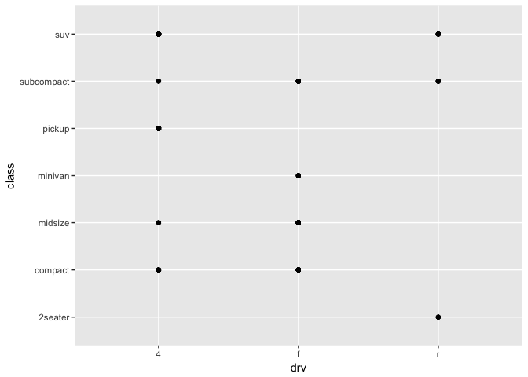
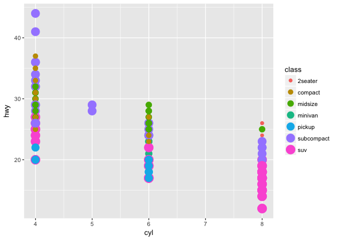
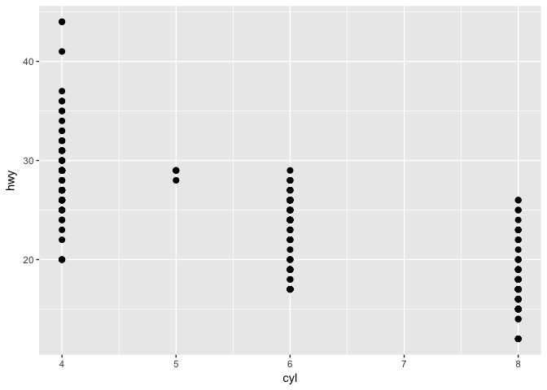
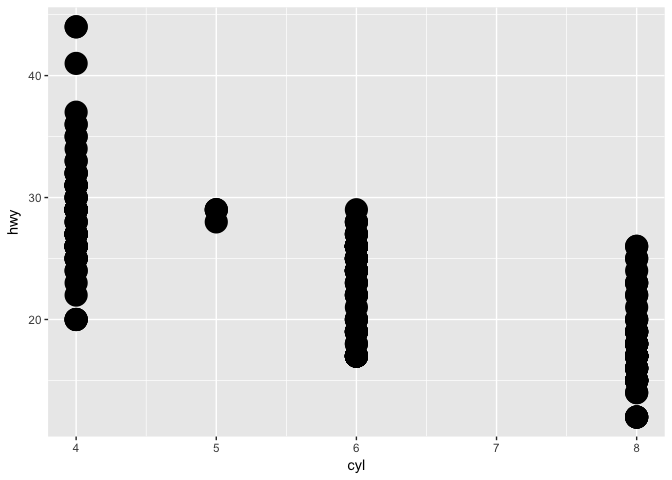
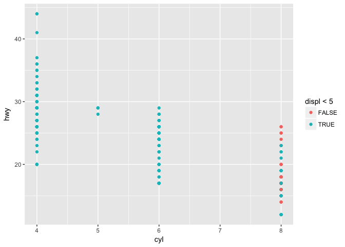
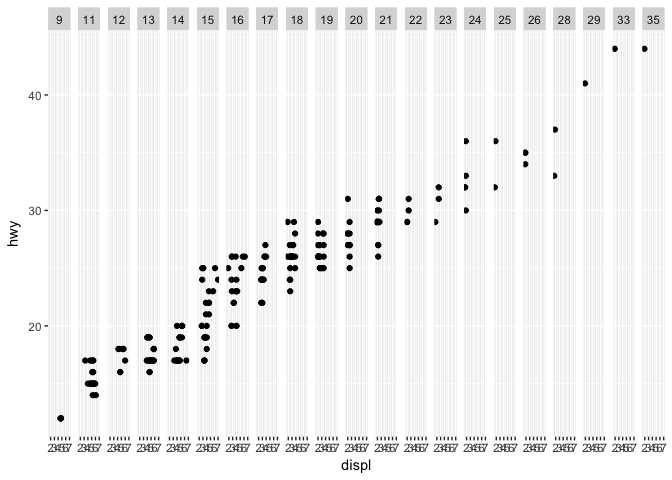

# Using ggplot2
Seungmo Kim  
4/25/2017  


\


### 3.2.4 Exercises

\


#### 1. Run ggplot(data = mpg) what do you see?

```r
ggplot(data = mpg)
```
A plot is not generated. The value of each axis and the type of plot should be specified.

\


#### 2. How many rows are in mtcars? How many columns?

```r
nrow(mtcars)
```

```
## [1] 32
```

```r
ncol(mtcars)
```

```
## [1] 11
```
number of rows: 32 &nbsp;&nbsp;number of column: 11

\


#### 3. What does the drv variable describe? Read the help for ?mpg to find out.

```r
?mpg
```

The drv variable describes driving system: f=front-wheel drive, r=rear wheel drive and 4=4 wheel drive.

\


#### 4. Make a scatterplot of hwy vs cyl.

```r
ggplot(data = mpg) + 
  geom_point(mapping = aes(x = cyl, y = hwy))
```

<!-- -->

\


#### 5. What happens if you make a scatterplot of class vs drv. Why is the plot not useful?

```r
ggplot(data = mpg) + 
  geom_point(mapping = aes(x = drv, y = class))
```

<!-- -->

Both variables are categorical. In this case, table may be more informative than graph.

\


### 3.3.1 Exercises

\


#### 1. What’s gone wrong with this code? Why are the points not blue?

```r
ggplot(data = mpg) + 
  geom_point(mapping = aes(x = displ, y = hwy, color = "blue"))
```

The aesthetic color should be outside of the aesthetic parenthesis to change the color of the points.


```r
ggplot(data = mpg) + 
  geom_point(mapping = aes(x = displ, y = hwy), color = "blue")
```

<!-- -->

\


#### 2. Which variables in mpg are categorical? Which variables are continuous? (Hint: type ?mpg to read the documentation for the dataset). How can you see this information when you run mpg?

```r
summary(mpg)
```

Categorical variables: manufacturer, model, trans, drv, fl and class\
Continuous (vs. discrete) : displ, year, cly, cty and hwy

\


#### 3. Map a continuous variable to color, size, and shape. How do these aesthetics behave differently for categorical vs. continuous variables?

```r
ggplot(mpg) + geom_point(mapping=aes(x=cyl, y=hwy, color=cty))
ggplot(mpg) + geom_point(mapping=aes(x=cyl, y=hwy, size=cty))
```

Continuous variables can be mapped to color and size on scaled gradient but not to shape.


```r
ggplot(mpg) + geom_point(mapping=aes(x=cyl, y=hwy, shape=cty))
```

\


#### 4. What happens if you map the same variable to multiple aesthetics?

```r
ggplot(mpg) + geom_point(mapping=aes(x=cyl, y=hwy, color=class, size=class))
```

<!-- -->

plotted on both aesthetics

\


#### 5. What does the stroke aesthetic do? What shapes does it work with? (Hint: use ?geom_point)

```r
ggplot(data = mpg) + 
  geom_point(mapping = aes(x = cyl, y = hwy, stroke = 1))
```

<!-- -->

```r
ggplot(data = mpg) + 
  geom_point(mapping = aes(x = cyl, y = hwy, stroke = 5))
```

<!-- -->

The aesthetic stroke adjusts the size of the points in geom_point. 

\


#### 6. What happens if you map an aesthetic to something other than a variable name, like aes(colour = displ < 5)?

```r
ggplot(mpg) + geom_point(mapping=aes(x=cyl, y=hwy, color=displ < 5))
```

<!-- -->

color=displ < 5: The color varies depending on whether the value meets the given condition.

```r
ggplot(mpg) + geom_point(mapping=aes(x=cyl, y=hwy, color=displ))
```

\


### 3.5.1 Exercises

\


#### 1. What happens if you facet on a continuous variable?

```r
ggplot(data = mpg) + 
  geom_point(mapping = aes(x = displ, y = hwy)) + 
  facet_grid(~cty)
```

<!-- -->

Too many facets may be generated and panels are difficult to compare.

\


#### 2. What do the empty cells in plot with facet_grid(drv ~ cyl) mean? How do they relate to this plot?

```r
ggplot(data = mpg) + 
  geom_point(mapping = aes(x = drv, y = cyl))
```

An empty cell means that there is no data (observation) corresponding to the variable represented by the facet.

\


#### 3. What plots does the following code make? What does . do?

```r
ggplot(data = mpg) + 
  geom_point(mapping = aes(x = displ, y = hwy)) +
  facet_grid(drv ~ .)
```

<!-- -->

```r
ggplot(data = mpg) + 
  geom_point(mapping = aes(x = displ, y = hwy)) +
  facet_grid(. ~ cyl)
```

<!-- -->

**facet_grid(drv ~ .)** facets data by kind of driving system _vertically_ while **facet_grid(. ~ cyl)** facets data by number of cylinders _horizontally_. Horizontal and verical placement of the facet may be chosen by the arranged format of data.

\


#### 4. Take the first faceted plot in this section:

```r
ggplot(data = mpg) + 
  geom_point(mapping = aes(x = displ, y = hwy)) + 
  facet_wrap(~ class, nrow = 2)
```

<!-- -->

#### What are the advantages to using faceting instead of the colour aesthetic? What are the disadvantages? How might the balance change if you had a larger dataset?  

Using faceting instead of color aesthetics allows us to visualize large datasets 'more clearly within the variables of interest'. However, it may not be able to provide a clear comprehensive trend across the entire data set.

\


#### 5. Read ?facet_wrap. What does nrow do? What does ncol do? What other options control the layout of the individual panels? Why doesn’t facet_grid() have nrow and ncol variables?

The arguments nrow and ncol set the number of rows and columns. We can place a label on one of the four sides by setting strip.position = c ("top", "bottom", "left", "right"). In facet_grid (), nrow and ncol can not be set, but facets can be placed in rows or columns by inserting '.'.

\


#### 6. When using facet_grid() you should usually put the variable with more unique levels in the columns. Why?

Facet_grid forms a matrix of panels defined by row and column or facet variable. If we put a variable with a unique level in the row, an ambiguous (?) feature may be returned. This principle applies to most graphs or tables.

