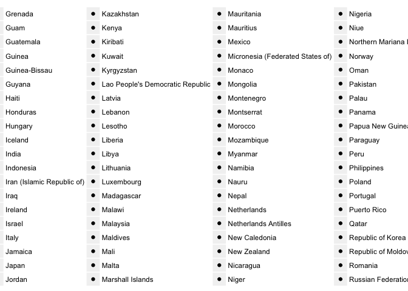

# 06212017_Kim.Seungmo


12.5.1 Exercises

1. Compare and contrast the fill arguments to spread() and complete().

    _spread(data, ..., fill = NA, ...)_ spreads a key-value pair across multiple columns. If argument fill is set, missing values will be replaced with this value. 
    _complete(data, ..., fill = list())_ turns implicit missing values into explicit missing values. Argument fill = list() also set a value to replace NA, but by a named list that for each variable supplies single value to use instead of NA.

 

2. What does the direction argument to fill() do?

    fill() fills missing values in using the previous entry.  Argument .direction = c("down", "up"), in which to fill missing values. Currently either "down" (the default) or "up".

12.6 Case Study

12.6.1 Exercises

1. In this case study I set na.rm = TRUE just to make it easier to check that we had the correct values. Is this reasonable? Think about how missing values are represented in this dataset. Are there implicit missing values? What’s the difference between an NA and zero?

    NA and 0 are totally different.  NA means no data but 0 a measurement(a kind of data!).  How can I find if there are implicit missing values???


2. What happens if you neglect the mutate() step? (mutate(key = stringr::str_replace(key, "newrel", "new_rel")))


```r
who %>%
  gather(code, value, new_sp_m014:newrel_f65, na.rm = TRUE) %>% 
  mutate(code = stringr::str_replace(code, "newrel", "new_rel")) %>%
  separate(code, c("new", "var", "sexage")) %>% 
  select(-new, -iso2, -iso3) %>% 
  separate(sexage, c("sex", "age"), sep = 1)
```

```
## # A tibble: 76,046 × 6
##        country  year   var   sex   age value
## *        <chr> <int> <chr> <chr> <chr> <int>
## 1  Afghanistan  1997    sp     m   014     0
## 2  Afghanistan  1998    sp     m   014    30
## 3  Afghanistan  1999    sp     m   014     8
## 4  Afghanistan  2000    sp     m   014    52
## 5  Afghanistan  2001    sp     m   014   129
## 6  Afghanistan  2002    sp     m   014    90
## 7  Afghanistan  2003    sp     m   014   127
## 8  Afghanistan  2004    sp     m   014   139
## 9  Afghanistan  2005    sp     m   014   151
## 10 Afghanistan  2006    sp     m   014   193
## # ... with 76,036 more rows
```


```r
who %>%
  gather(code, value, new_sp_m014:newrel_f65, na.rm = TRUE) %>% 
  separate(code, c("new", "var", "sexage")) %>% 
  select(-new, -iso2, -iso3) %>% 
  separate(sexage, c("sex", "age"), sep = 1)
```

```
## Warning: Too few values at 2580 locations: 73467, 73468, 73469, 73470,
## 73471, 73472, 73473, 73474, 73475, 73476, 73477, 73478, 73479, 73480,
## 73481, 73482, 73483, 73484, 73485, 73486, ...
```

```
## # A tibble: 76,046 × 6
##        country  year   var   sex   age value
## *        <chr> <int> <chr> <chr> <chr> <int>
## 1  Afghanistan  1997    sp     m   014     0
## 2  Afghanistan  1998    sp     m   014    30
## 3  Afghanistan  1999    sp     m   014     8
## 4  Afghanistan  2000    sp     m   014    52
## 5  Afghanistan  2001    sp     m   014   129
## 6  Afghanistan  2002    sp     m   014    90
## 7  Afghanistan  2003    sp     m   014   127
## 8  Afghanistan  2004    sp     m   014   139
## 9  Afghanistan  2005    sp     m   014   151
## 10 Afghanistan  2006    sp     m   014   193
## # ... with 76,036 more rows
```

```r
# Some values are missing....
```

3. I claimed that iso2 and iso3 were redundant with country. Confirm this claim.

```r
who %>%
  select(country:iso3) %>%
  nrow()
```

```
## [1] 7240
```

```r
# to retain only distinct rows using unique()
who %>%
  select(country:iso3) %>%
  unique() %>%
  nrow()
```

```
## [1] 219
```

```r
who %>%
  select(country:iso2) %>%
  unique() %>%
  nrow()
```

```
## [1] 219
```

```r
who %>%
  select(country) %>%
  unique() %>%
  nrow()
```

```
## [1] 219
```

    We conclude country = iso2 = iso3.
 

4. For each country, year, and sex compute the total number of cases of TB. Make an informative visualisation of the data.

```r
who.transformed <- who %>%
  gather(code, value, new_sp_m014:newrel_f65, na.rm = TRUE) %>% 
  mutate(code = stringr::str_replace(code, "newrel", "new_rel")) %>%
  separate(code, c("new", "var", "sexage")) %>% 
  select(-new, -iso2, -iso3) %>% 
  separate(sexage, c("sex", "age"), sep = 1)
```


```r
# to summarize total cases by country, year and sex
who.cases.by.group <-
  group_by(who.transformed, country, year, sex) %>% 
  summarize(num.case = sum(value))   
```

```r
# ?????? need help!
ggplot(who.cases.by.group, aes(x = year, y = num.case)) +
  geom_point(aes(fill=country)) +
  facet_wrap(~sex)
```

<!-- -->


13. Relational data

13.1 Introduction


```r
library(nycflights13)
```

13.2 nycflights13

13.2.1 Exercises

1. Imagine you wanted to draw (approximately) the route each plane flies from its origin to its destination. What variables would you need? What tables would you need to combine?

    faa in table airports    origin and dest in table filghts

2. I forgot to draw the relationship between weather and airports. What is the relationship and how should it appear in the diagram?

```r
colnames(weather)
```

```
##  [1] "origin"     "year"       "month"      "day"        "hour"      
##  [6] "temp"       "dewp"       "humid"      "wind_dir"   "wind_speed"
## [11] "wind_gust"  "precip"     "pressure"   "visib"      "time_hour"
```

```r
colnames(airports)
```

```
## [1] "faa"   "name"  "lat"   "lon"   "alt"   "tz"    "dst"   "tzone"
```

    We need to connect faa(for each airport) in airports with origin in weather(e.g. EWR in airports and in weather)
    
3. weather only contains information for the origin (NYC) airports. If it contained weather records for all airports in the USA, what additional relation would it define with flights?

     We will be able to check the weather conditions at the time the flight arrive at its destination.

4. We know that some days of the year are “special”, and fewer people than usual fly on them. How might you represent that data as a data frame? What would be the primary keys of that table? How would it connect to the existing tables?

    Special days for someone... We will be able to make a table with the year, month and day, and column of national holidays such as Christmas. The table can be related to flights through the year, month, and day.
