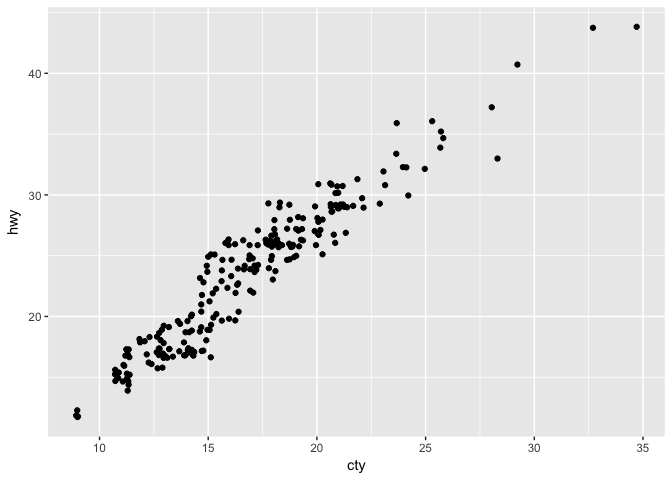
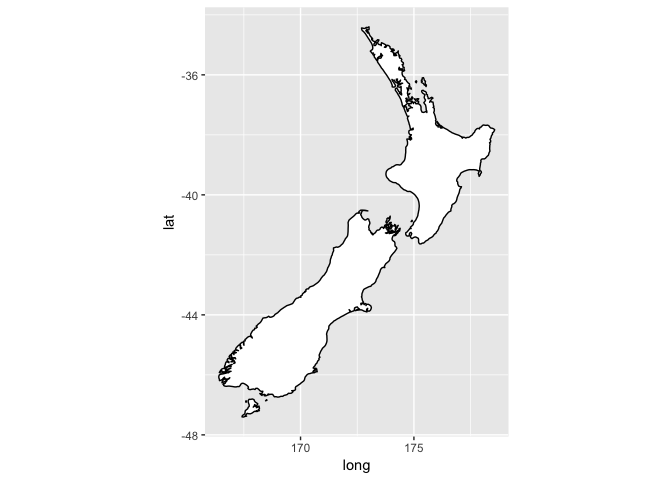
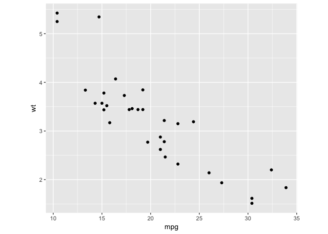

# Assignment_Kim.Seungmo_05032017


### 3.6.1 Exercises

1. What geom would you use to draw a line chart? A boxplot? A histogram? An area chart?

```r
p <- ggplot(data = mpg, aes(x = displ, y = hwy))
p + geom_line()
```

<!-- -->

```r
p + geom_boxplot()
```

```
## Warning: Continuous x aesthetic -- did you forget aes(group=...)?
```

<!-- -->

```r
p + geom_area()
```

<!-- -->

```r
q <- ggplot(data = mpg, mapping = aes(x = displ))
q + geom_histogram()
```

```
## `stat_bin()` using `bins = 30`. Pick better value with `binwidth`.
```

<!-- -->

2. Run this code in your head and predict what the output will look like. Then, run the code in R and check your predictions.

A scatter plot with a line with smooth shape. It is a plot of hwy on displ colored by drv.

```r
ggplot(data = mpg, mapping = aes(x = displ, y = hwy, color = drv)) + 
  geom_point() + 
  geom_smooth(se = FALSE)
```

```
## `geom_smooth()` using method = 'loess'
```

<!-- -->

3.What does show.legend = FALSE do? What happens if you remove it?

show.legend = FALSE removes the legend not to show unnecessary data in a plot. If it is removed, the regend will be show up.


4.What does the se argument to geom_smooth() do?

geom_smooth(se=TRUE) adds a confidence interval around the line.


5.Will these two graphs look different? Why/why not?

```r
ggplot(data = mpg, aes(x = displ, y = hwy)) + 
  geom_point() + 
  geom_smooth()
```

```
## `geom_smooth()` using method = 'loess'
```

<!-- -->

```r
ggplot() + 
  geom_point(data = mpg, aes(x = displ, y = hwy)) + 
  geom_smooth(data = mpg, aes(x = displ, y = hwy))
```

```
## `geom_smooth()` using method = 'loess'
```

<!-- -->
The two graphs are the same. 
above) The global setting for all geoms is made in ggplot()
below) Multiple setting for each individual geom were made. 
For the repeated setting, a global setting can be more efficient.

6. Recreate the R code necessary to generate the following graphs.

```r
p <- ggplot(data = mpg, mapping = aes(x = displ, y = hwy))  
p + geom_point(size=2.5) + 
    geom_smooth(se=FALSE, size=1)
```

```
## `geom_smooth()` using method = 'loess'
```

<!-- -->

```r
p + geom_point(size=2.5) + 
    geom_smooth(se=FALSE, size=1, aes(group=drv))
```

```
## `geom_smooth()` using method = 'loess'
```

<!-- -->

```r
ggplot(data = mpg, mapping = aes(x = displ, y = hwy, color=drv)) +
  geom_point(size=2.5, aes(fill=drv)) + 
  geom_smooth(se=FALSE, size=1)
```

```
## `geom_smooth()` using method = 'loess'
```

<!-- -->

```r
p + geom_point(size=2.5, aes(color = drv)) + 
  geom_smooth(se=FALSE, size=1)
```

```
## `geom_smooth()` using method = 'loess'
```

<!-- -->

```r
p + geom_point(size=2.5, aes(color=drv)) + 
  geom_smooth(se=FALSE, size=1, aes(linetype=drv))
```

```
## `geom_smooth()` using method = 'loess'
```

<!-- -->

```r
p + 
  geom_point(aes(fill=drv), shape = 21, color = "white", size = 2.5, stroke = 2)
```

<!-- -->

### 3.7.1 Exercises

1. What is the default geom associated with stat_summary()? How could you rewrite the previous plot to use that geom function instead of the stat function?

geom_pointrange()

```r
ggplot(data = diamonds, aes(x = cut, y = depth)) + 
  geom_pointrange(stat="summary", fun.ymin = min, fun.ymax = max, fun.y = median)
```

<!-- -->
2. What does geom_col() do? How is it different to geom_bar()?

```r
ggplot(data = diamonds) + 
  geom_bar(mapping = aes(x = cut, y = ..prop.., group = 1))
```

<!-- -->

```r
ggplot(data = diamonds) + 
  geom_col(mapping = aes(x = cut, y = 1))
```

<!-- -->
for bar charts 
1) geom_bar: makes the height of the bars proportional to the number of cases in each group, using stat_count by default(counts the number of cases at each x position)
2) geom_col: makes the heights of the bars to represent values in the data, using stat_identity(leaves the data as is)


3. Most geoms and stats come in pairs that are almost always used in concert. Read through the documentation and make a list of all the pairs. What do they have in common?

4. What variables does stat_smooth() compute? What parameters control its behaviour?

stat_smooth() computes y, ymin, ymax and se(standard error).
Its behavior is controlled by parameters:
method, smoothing method	
formula, formula to use in smoothing function,
se	
na.rm	
show.legend	
geom	
n, number of points to evaluate smoother at
span, controls the amount of smoothing for the default loess smoother. Smaller numbers produce wigglier lines, larger numbers produce smoother lines.
fullrange	
level, level of confidence interval to use (0.95 by default)

5. In our proportion bar chart, we need to set group = 1. Why? In other words what is the problem with these two graphs?


```r
ggplot(data = diamonds) + 
  geom_bar(aes(x = cut, y = ..prop..))
```

<!-- -->

```r
ggplot(data = diamonds) + 
  geom_bar(aes(x = cut, fill = color, y = ..prop..))
```

<!-- -->

```r
ggplot(data = diamonds) + 
  geom_bar(mapping = aes(x = cut, y = ..prop.., group = 1))
```

<!-- -->

  

### 3.8.1 Exercises

1. What is the problem with this plot? How could you improve it?

```r
ggplot(data = mpg, aes(x = cty, y = hwy)) + 
  geom_point()
```

<!-- -->


```r
ggplot(data = mpg, mapping = aes(x = cty, y = hwy)) + 
  geom_point(position="jitter")
```

<!-- -->
geom_jitter () spreads the points out to prevent overplotting.  Overplotting is when one or more points are in the same place (or close enough to the same place).
Adding randomness improves the plot, especially on large scales rather than small scales.
 
2. What parameters to geom_jitter() control the amount of jittering?

```r
ggplot(data = mpg, mapping = aes(x = cty, y = hwy)) + 
  geom_jitter(size=1.5)
```

<!-- -->
width and height

3. Compare and contrast geom_jitter() with geom_count().

```r
ggplot(data = mpg, mapping = aes(x = cty, y = hwy)) + 
  geom_jitter()
```

<!-- -->

```r
ggplot(data = mpg, mapping = aes(x = cty, y = hwy)) + 
  geom_count()
```

<!-- -->
Both are used to help avoid overplotting. geom_jitter() in continuous X & continuous Y and geom_count() in discrete X and discrete Y. 

4. What’s the default position adjustment for geom_boxplot()? Create a visualisation of the mpg dataset that demonstrates it.

The default adjustment is position_dodge. This means that the points are moved to the side by a discrete amount

```r
p <- ggplot(data = mpg, aes(x=drv, y=cty)) 
p + geom_boxplot() 
```

<!-- -->

```r
p + geom_boxplot(position='dodge') # the same
```

<!-- -->


### 3.9.1 Exercises

1. Turn a stacked bar chart into a pie chart using coord_polar().

```r
p <- ggplot(data=diamonds, aes(cut, fill=clarity))
p + geom_bar() + coord_polar()
```

<!-- -->

2. What does labs() do? Read the documentation.
labs() names X- & Y-axis and title.

3. What’s the difference between coord_quickmap() and coord_map()?
coord_map projects a portion of the earth, which is approximately spherical, onto a flat 2D plane using any projection defined by the mapproj package. Map projections do not, in general, preserve straight lines, so this requires considerable computation. coord_quickmap is a quick approximation that does preserve straight lines. It works best for smaller areas closer to the equator.


```r
nz <- map_data("nz")

ggplot(nz, aes(long, lat, group = group)) +
  geom_polygon(fill = "white", colour = "black")
```

<!-- -->

```r
ggplot(nz, aes(long, lat, group = group)) +
  geom_polygon(fill = "white", colour = "black") +
  coord_quickmap()
```

<!-- -->

```r
ggplot(nz, aes(long, lat, group = group)) +
  geom_polygon(fill = "white", colour = "black") +
  coord_map()
```

<!-- -->


4. What does the plot below tell you about the relationship between city and highway mpg? Why is coord_fixed() important? What does geom_abline() do?

```r
ggplot(data = mpg, mapping = aes(x = cty, y = hwy)) +
  geom_point() + geom_abline() +
  coord_fixed()
```

<!-- -->


```r
# ensures that the ranges of axes are equal to the specified ratio by
# adjusting the plot aspect ratio

p <- ggplot(mtcars, aes(mpg, wt)) + geom_point()
p + coord_fixed(ratio = 1)
```

<!-- -->

```r
p + coord_fixed(ratio = 5)
```

<!-- -->

```r
p + coord_fixed(ratio = 1/5)
```

<!-- -->

```r
# Resize the plot to see that the specified aspect ratio is maintained
```

