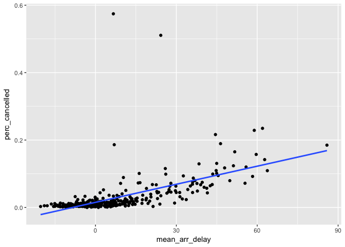
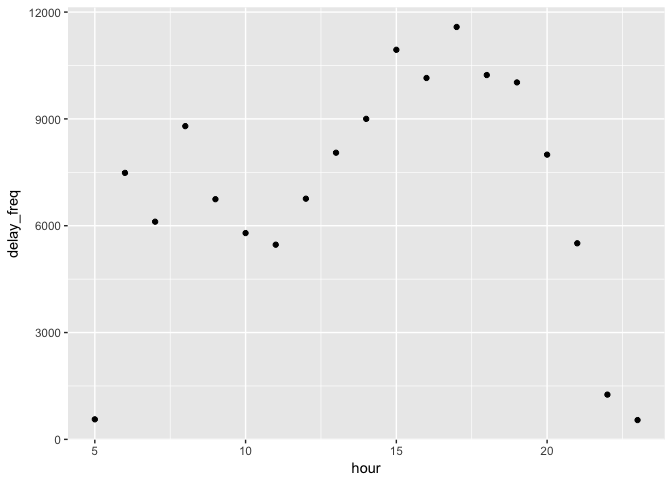

# 05172017


```r
library(nycflights13)
library(tidyverse)
```

```
## Loading tidyverse: ggplot2
## Loading tidyverse: tibble
## Loading tidyverse: tidyr
## Loading tidyverse: readr
## Loading tidyverse: purrr
## Loading tidyverse: dplyr
```

```
## Conflicts with tidy packages ----------------------------------------------
```

```
## filter(): dplyr, stats
## lag():    dplyr, stats
```

### 5.6 Grouped summaries with summarise()

```r
summarise(flights, delay = mean(dep_delay, na.rm = TRUE))
```

```
## # A tibble: 1 × 1
##      delay
##      <dbl>
## 1 12.63907
```

```r
by_day <- group_by(flights, year, month, day)
summarise(by_day, delay = mean(dep_delay, na.rm = TRUE)) # get the average delay per date
```

```
## Source: local data frame [365 x 4]
## Groups: year, month [?]
## 
##     year month   day     delay
##    <int> <int> <int>     <dbl>
## 1   2013     1     1 11.548926
## 2   2013     1     2 13.858824
## 3   2013     1     3 10.987832
## 4   2013     1     4  8.951595
## 5   2013     1     5  5.732218
## 6   2013     1     6  7.148014
## 7   2013     1     7  5.417204
## 8   2013     1     8  2.553073
## 9   2013     1     9  2.276477
## 10  2013     1    10  2.844995
## # ... with 355 more rows
```
#### 5.6.1 Combining multiple operations with the pipe
To explore the relationship between the distance and average delay for each location.

```r
by_dest <- group_by(flights, dest)
delay <- summarise(by_dest,
  count = n(),
  dist = mean(distance, na.rm = TRUE),
  delay = mean(arr_delay, na.rm = TRUE))
(delay <- filter(delay, count > 20, dest != "HNL"))
```

```
## # A tibble: 96 × 4
##     dest count      dist     delay
##    <chr> <int>     <dbl>     <dbl>
## 1    ABQ   254 1826.0000  4.381890
## 2    ACK   265  199.0000  4.852273
## 3    ALB   439  143.0000 14.397129
## 4    ATL 17215  757.1082 11.300113
## 5    AUS  2439 1514.2530  6.019909
## 6    AVL   275  583.5818  8.003831
## 7    BDL   443  116.0000  7.048544
## 8    BGR   375  378.0000  8.027933
## 9    BHM   297  865.9966 16.877323
## 10   BNA  6333  758.2135 11.812459
## # ... with 86 more rows
```

```r
# It looks like delays increase with distance up to ~750 miles 
# and then decrease. Maybe as flights get longer there's more 
# ability to make up delays in the air?
ggplot(delay, aes(x = dist, y = delay)) +
  geom_point(aes(size = count), alpha = 1/3) +
  geom_smooth(se = FALSE)
```

```
## `geom_smooth()` using method = 'loess'
```

<!-- -->


```r
  group_by(flights, dest) %>% 
  summarise(
    count = n(),
    dist = mean(distance, na.rm = TRUE),
    delay = mean(arr_delay, na.rm = TRUE)
  ) %>% 
  filter(count > 20, dest != "HNL")
```

```
## # A tibble: 96 × 4
##     dest count      dist     delay
##    <chr> <int>     <dbl>     <dbl>
## 1    ABQ   254 1826.0000  4.381890
## 2    ACK   265  199.0000  4.852273
## 3    ALB   439  143.0000 14.397129
## 4    ATL 17215  757.1082 11.300113
## 5    AUS  2439 1514.2530  6.019909
## 6    AVL   275  583.5818  8.003831
## 7    BDL   443  116.0000  7.048544
## 8    BGR   375  378.0000  8.027933
## 9    BHM   297  865.9966 16.877323
## 10   BNA  6333  758.2135 11.812459
## # ... with 86 more rows
```
#### 5.6.2 Missing values

Without na.rm = TRUE
The usual rule of missing values: if there’s any missing value in the input, the output will be a missing value.

```r
flights %>% 
  group_by(year, month, day) %>% 
  summarise(mean = mean(dep_delay))
```

```
## Source: local data frame [365 x 4]
## Groups: year, month [?]
## 
##     year month   day  mean
##    <int> <int> <int> <dbl>
## 1   2013     1     1    NA
## 2   2013     1     2    NA
## 3   2013     1     3    NA
## 4   2013     1     4    NA
## 5   2013     1     5    NA
## 6   2013     1     6    NA
## 7   2013     1     7    NA
## 8   2013     1     8    NA
## 9   2013     1     9    NA
## 10  2013     1    10    NA
## # ... with 355 more rows
```
With na.rm = TRUE which removes the missing values prior to computation

```r
flights %>% 
  group_by(year, month, day) %>% 
  summarise(mean = mean(dep_delay, na.rm = TRUE))
```

```
## Source: local data frame [365 x 4]
## Groups: year, month [?]
## 
##     year month   day      mean
##    <int> <int> <int>     <dbl>
## 1   2013     1     1 11.548926
## 2   2013     1     2 13.858824
## 3   2013     1     3 10.987832
## 4   2013     1     4  8.951595
## 5   2013     1     5  5.732218
## 6   2013     1     6  7.148014
## 7   2013     1     7  5.417204
## 8   2013     1     8  2.553073
## 9   2013     1     9  2.276477
## 10  2013     1    10  2.844995
## # ... with 355 more rows
```
To save a data set of not_cancelled

```r
not_cancelled <- flights %>% 
  filter(!is.na(dep_delay), !is.na(arr_delay))

not_cancelled %>% 
  group_by(year, month, day) %>% 
  summarise(mean = mean(dep_delay))
```

```
## Source: local data frame [365 x 4]
## Groups: year, month [?]
## 
##     year month   day      mean
##    <int> <int> <int>     <dbl>
## 1   2013     1     1 11.435620
## 2   2013     1     2 13.677802
## 3   2013     1     3 10.907778
## 4   2013     1     4  8.965859
## 5   2013     1     5  5.732218
## 6   2013     1     6  7.145959
## 7   2013     1     7  5.417204
## 8   2013     1     8  2.558296
## 9   2013     1     9  2.301232
## 10  2013     1    10  2.844995
## # ... with 355 more rows
```

#### 5.6.3 Counts
To look at the planes (identified by their tail number) that have the highest average delays:

```r
delays <- not_cancelled %>% 
  group_by(tailnum) %>% 
  summarise(delay = mean(arr_delay))

ggplot(data = delays, mapping = aes(x = delay)) + 
  geom_freqpoly(binwidth = 10)
```

<!-- -->
To draw a scatterplot of number of flights vs. average delay:

```r
delays <- not_cancelled %>% 
  group_by(tailnum) %>% 
  summarise(
    delay = mean(arr_delay, na.rm = TRUE),
    n = n()
  )

ggplot(data = delays, mapping = aes(x = n, y = delay)) + 
  geom_point(alpha = 1/10)
```

<!-- -->
To filter out the groups with the smallest numbers of observations, so you can see more of the pattern and less of the extreme variation in the smallest groups. 

```r
delays %>% 
  filter(n > 25) %>% 
  ggplot(mapping = aes(x = n, y = delay)) + 
    geom_point(alpha = 1/10)
```

<!-- -->
### 5.6.4 Useful summary functions


```r
not_cancelled %>% 
  group_by(year, month, day) %>% 
  summarise(
    avg_delay1 = mean(arr_delay),
    avg_delay2 = mean(arr_delay[arr_delay > 0]) # the average positive delay
  )
```

```
## Source: local data frame [365 x 5]
## Groups: year, month [?]
## 
##     year month   day avg_delay1 avg_delay2
##    <int> <int> <int>      <dbl>      <dbl>
## 1   2013     1     1 12.6510229   32.48156
## 2   2013     1     2 12.6928879   32.02991
## 3   2013     1     3  5.7333333   27.66087
## 4   2013     1     4 -1.9328194   28.30976
## 5   2013     1     5 -1.5258020   22.55882
## 6   2013     1     6  4.2364294   24.37270
## 7   2013     1     7 -4.9473118   27.76132
## 8   2013     1     8 -3.2275785   20.78909
## 9   2013     1     9 -0.2642777   25.63415
## 10  2013     1    10 -5.8988159   27.34545
## # ... with 355 more rows
```


```r
# Why is distance to some destinations more variable than to others?
not_cancelled %>% 
  group_by(dest) %>% 
  summarise(distance_sd = sd(distance)) %>% 
  arrange(desc(distance_sd))
```

```
## # A tibble: 104 × 2
##     dest distance_sd
##    <chr>       <dbl>
## 1    EGE   10.542765
## 2    SAN   10.350094
## 3    SFO   10.216017
## 4    HNL   10.004197
## 5    SEA    9.977993
## 6    LAS    9.907786
## 7    PDX    9.873299
## 8    PHX    9.862546
## 9    LAX    9.657195
## 10   IND    9.458066
## # ... with 94 more rows
```


```r
# When do the first and last flights leave each day?
not_cancelled %>% 
  group_by(year, month, day) %>% 
  summarise(
    first = min(dep_time),
    last = max(dep_time)
  )
```

```
## Source: local data frame [365 x 5]
## Groups: year, month [?]
## 
##     year month   day first  last
##    <int> <int> <int> <int> <int>
## 1   2013     1     1   517  2356
## 2   2013     1     2    42  2354
## 3   2013     1     3    32  2349
## 4   2013     1     4    25  2358
## 5   2013     1     5    14  2357
## 6   2013     1     6    16  2355
## 7   2013     1     7    49  2359
## 8   2013     1     8   454  2351
## 9   2013     1     9     2  2252
## 10  2013     1    10     3  2320
## # ... with 355 more rows
```


```r
not_cancelled %>% 
  group_by(year, month, day) %>% 
  summarise(
    first_dep = first(dep_time), 
    last_dep = last(dep_time)
  )
```

```
## Source: local data frame [365 x 5]
## Groups: year, month [?]
## 
##     year month   day first_dep last_dep
##    <int> <int> <int>     <int>    <int>
## 1   2013     1     1       517     2356
## 2   2013     1     2        42     2354
## 3   2013     1     3        32     2349
## 4   2013     1     4        25     2358
## 5   2013     1     5        14     2357
## 6   2013     1     6        16     2355
## 7   2013     1     7        49     2359
## 8   2013     1     8       454     2351
## 9   2013     1     9         2     2252
## 10  2013     1    10         3     2320
## # ... with 355 more rows
```


```r
not_cancelled %>% 
  group_by(year, month, day) %>% 
  mutate(r = min_rank(desc(dep_time))) %>% 
  filter(r %in% range(r))
```

```
## Source: local data frame [770 x 20]
## Groups: year, month, day [365]
## 
##     year month   day dep_time sched_dep_time dep_delay arr_time
##    <int> <int> <int>    <int>          <int>     <dbl>    <int>
## 1   2013     1     1      517            515         2      830
## 2   2013     1     1     2356           2359        -3      425
## 3   2013     1     2       42           2359        43      518
## 4   2013     1     2     2354           2359        -5      413
## 5   2013     1     3       32           2359        33      504
## 6   2013     1     3     2349           2359       -10      434
## 7   2013     1     4       25           2359        26      505
## 8   2013     1     4     2358           2359        -1      429
## 9   2013     1     4     2358           2359        -1      436
## 10  2013     1     5       14           2359        15      503
## # ... with 760 more rows, and 13 more variables: sched_arr_time <int>,
## #   arr_delay <dbl>, carrier <chr>, flight <int>, tailnum <chr>,
## #   origin <chr>, dest <chr>, air_time <dbl>, distance <dbl>, hour <dbl>,
## #   minute <dbl>, time_hour <dttm>, r <int>
```


```r
# Which destinations have the most carriers?
not_cancelled %>% 
  group_by(dest) %>% 
  summarise(carriers = n_distinct(carrier)) %>%  # to count the number of distinct values
  arrange(desc(carriers))
```

```
## # A tibble: 104 × 2
##     dest carriers
##    <chr>    <int>
## 1    ATL        7
## 2    BOS        7
## 3    CLT        7
## 4    ORD        7
## 5    TPA        7
## 6    AUS        6
## 7    DCA        6
## 8    DTW        6
## 9    IAD        6
## 10   MSP        6
## # ... with 94 more rows
```


```r
not_cancelled %>% 
  count(dest)
```

```
## # A tibble: 104 × 2
##     dest     n
##    <chr> <int>
## 1    ABQ   254
## 2    ACK   264
## 3    ALB   418
## 4    ANC     8
## 5    ATL 16837
## 6    AUS  2411
## 7    AVL   261
## 8    BDL   412
## 9    BGR   358
## 10   BHM   269
## # ... with 94 more rows
```

```r
not_cancelled %>% 
  count(tailnum, wt = distance)
```

```
## # A tibble: 4,037 × 2
##    tailnum      n
##      <chr>  <dbl>
## 1   D942DN   3418
## 2   N0EGMQ 239143
## 3   N10156 109664
## 4   N102UW  25722
## 5   N103US  24619
## 6   N104UW  24616
## 7   N10575 139903
## 8   N105UW  23618
## 9   N107US  21677
## 10  N108UW  32070
## # ... with 4,027 more rows
```


```r
# How many flights left before 5am? (these usually indicate delayed
# flights from the previous day)
not_cancelled %>% 
  group_by(year, month, day) %>% 
  summarise(n_early = sum(dep_time < 500))
```

```
## Source: local data frame [365 x 4]
## Groups: year, month [?]
## 
##     year month   day n_early
##    <int> <int> <int>   <int>
## 1   2013     1     1       0
## 2   2013     1     2       3
## 3   2013     1     3       4
## 4   2013     1     4       3
## 5   2013     1     5       3
## 6   2013     1     6       2
## 7   2013     1     7       2
## 8   2013     1     8       1
## 9   2013     1     9       3
## 10  2013     1    10       3
## # ... with 355 more rows
```


```r
# What proportion of flights are delayed by more than an hour?
not_cancelled %>% 
  group_by(year, month, day) %>% 
  summarise(hour_perc = mean(arr_delay > 60))
```

```
## Source: local data frame [365 x 4]
## Groups: year, month [?]
## 
##     year month   day  hour_perc
##    <int> <int> <int>      <dbl>
## 1   2013     1     1 0.07220217
## 2   2013     1     2 0.08512931
## 3   2013     1     3 0.05666667
## 4   2013     1     4 0.03964758
## 5   2013     1     5 0.03486750
## 6   2013     1     6 0.04704463
## 7   2013     1     7 0.03333333
## 8   2013     1     8 0.02130045
## 9   2013     1     9 0.02015677
## 10  2013     1    10 0.01829925
## # ... with 355 more rows
```
### 5.6.5 Grouping by multiple variables

When you group by multiple variables, each summary peels off one level of the grouping. That makes it easy to progressively roll up a dataset:


```r
daily <- group_by(flights, year, month, day)
(per_day   <- summarise(daily, flights = n()))
```

```
## Source: local data frame [365 x 4]
## Groups: year, month [?]
## 
##     year month   day flights
##    <int> <int> <int>   <int>
## 1   2013     1     1     842
## 2   2013     1     2     943
## 3   2013     1     3     914
## 4   2013     1     4     915
## 5   2013     1     5     720
## 6   2013     1     6     832
## 7   2013     1     7     933
## 8   2013     1     8     899
## 9   2013     1     9     902
## 10  2013     1    10     932
## # ... with 355 more rows
```


```r
(per_month <- summarise(per_day, flights = sum(flights)))
```

```
## Source: local data frame [12 x 3]
## Groups: year [?]
## 
##     year month flights
##    <int> <int>   <int>
## 1   2013     1   27004
## 2   2013     2   24951
## 3   2013     3   28834
## 4   2013     4   28330
## 5   2013     5   28796
## 6   2013     6   28243
## 7   2013     7   29425
## 8   2013     8   29327
## 9   2013     9   27574
## 10  2013    10   28889
## 11  2013    11   27268
## 12  2013    12   28135
```

```r
(per_year  <- summarise(per_month, flights = sum(flights)))
```

```
## # A tibble: 1 × 2
##    year flights
##   <int>   <int>
## 1  2013  336776
```
### 5.6.6 Ungrouping

If you need to remove grouping, and return to operations on ungrouped data, use ungroup().


```r
daily %>% 
  ungroup() %>%             # no longer grouped by date
  summarise(flights = n())  # all flights
```

```
## # A tibble: 1 × 1
##   flights
##     <int>
## 1  336776
```
### 5.6.7 Exercises

**1. Brainstorm at least 5 different ways to assess the typical delay characteristics of a group of flights. Consider the following scenarios:

a. A flight is 15 minutes early 50% of the time, and 15 minutes late 50% of the time. 
##### Hey, question. What do you want me to do?

```r
not_cancelled %>% group_by(flight) %>%
  summarize(freq_delayed_15 = sum(arr_delay == 15), 
            freq_early_15 = sum(arr_delay == -15),
            num_flight = n()) %>%  
  filter(freq_delayed_15/num_flight == 0.5 )
```

```
## # A tibble: 3 × 4
##   flight freq_delayed_15 freq_early_15 num_flight
##    <int>           <int>         <int>      <int>
## 1    730               1             0          2
## 2   3409               1             0          2
## 3   4313               1             0          2
```


b. A flight is always 10 minutes late.

```r
not_cancelled %>% group_by(flight) %>%  
    filter(mean(arr_delay==10)==1) %>%
    select(year:day, flight, arr_delay)
```

```
## Source: local data frame [5 x 5]
## Groups: flight [5]
## 
##    year month   day flight arr_delay
##   <int> <int> <int>  <int>     <dbl>
## 1  2013    12    10   2254        10
## 2  2013     4    28   3656        10
## 3  2013     6    16   3785        10
## 4  2013     8    13   5854        10
## 5  2013     8    31   3880        10
```

c. A flight is 30 minutes early 50% of the time, and 30 minutes late 50% of the time.


```r
not_cancelled %>% group_by(flight) %>%
  summarize(freq_delayed_30 = sum(arr_delay == 30), 
            freq_early_30 = sum(arr_delay == -30),
            num_flight = n()) %>%  
  filter(freq_delayed_30/num_flight == 0.5 )
```

```
## # A tibble: 2 × 4
##   flight freq_delayed_30 freq_early_30 num_flight
##    <int>           <int>         <int>      <int>
## 1   1126               1             0          2
## 2   3589               1             0          2
```
d. 99% of the time a flight is on time. 1% of the time it’s 2 hours late.

```r
not_cancelled %>% group_by(flight) %>%
  summarize(freq_on_time = sum(arr_delay == 0), 
            freq_late_120 = sum(arr_delay == 120),
            num_flight = n()) %>%  
  filter(freq_on_time/num_flight == 0.99 )
```

```
## # A tibble: 0 × 4
## # ... with 4 variables: flight <int>, freq_on_time <int>,
## #   freq_late_120 <int>, num_flight <int>
```

```r
# ooops.  There can't be such a flight!
```
Which is more important: arrival delay or departure delay?

```r
# Arrival delay should be more important, because getting to destination on time would affect our next business.
```

2. Come up with another approach that will give you the same output as not_cancelled %>% count(dest) and not_cancelled %>% count(tailnum, wt = distance) (without using count()).

```r
not_cancelled %>% count(dest)
```

```
## # A tibble: 104 × 2
##     dest     n
##    <chr> <int>
## 1    ABQ   254
## 2    ACK   264
## 3    ALB   418
## 4    ANC     8
## 5    ATL 16837
## 6    AUS  2411
## 7    AVL   261
## 8    BDL   412
## 9    BGR   358
## 10   BHM   269
## # ... with 94 more rows
```

```r
not_cancelled %>% group_by(dest) %>% summarize(n=n())
```

```
## # A tibble: 104 × 2
##     dest     n
##    <chr> <int>
## 1    ABQ   254
## 2    ACK   264
## 3    ALB   418
## 4    ANC     8
## 5    ATL 16837
## 6    AUS  2411
## 7    AVL   261
## 8    BDL   412
## 9    BGR   358
## 10   BHM   269
## # ... with 94 more rows
```


```r
not_cancelled %>% count(tailnum, wt = distance)
```

```
## # A tibble: 4,037 × 2
##    tailnum      n
##      <chr>  <dbl>
## 1   D942DN   3418
## 2   N0EGMQ 239143
## 3   N10156 109664
## 4   N102UW  25722
## 5   N103US  24619
## 6   N104UW  24616
## 7   N10575 139903
## 8   N105UW  23618
## 9   N107US  21677
## 10  N108UW  32070
## # ... with 4,027 more rows
```

```r
not_cancelled %>% group_by(tailnum) %>%
  tally(wt=distance) # tally() is to summarize that will either call n or sum(n)???
```

```
## # A tibble: 4,037 × 2
##    tailnum      n
##      <chr>  <dbl>
## 1   D942DN   3418
## 2   N0EGMQ 239143
## 3   N10156 109664
## 4   N102UW  25722
## 5   N103US  24619
## 6   N104UW  24616
## 7   N10575 139903
## 8   N105UW  23618
## 9   N107US  21677
## 10  N108UW  32070
## # ... with 4,027 more rows
```

3. Our definition of cancelled flights (is.na(dep_delay) | is.na(arr_delay) ) is slightly suboptimal. Why? Which is the most important column?

```r
# arr_delay is the key column. We sometimes see an airplane that departs but does not arrive.
```

4. Look at the number of cancelled flights per day. Is there a pattern? Is the proportion of cancelled flights related to the average delay?

```r
cancelled_per_day <- flights %>% 
  group_by(year, month, day) %>%
  summarize(num_flight_per_day=n(), 
            cancelled=sum(is.na(arr_delay)),
            perc_cancelled=cancelled/num_flight_per_day,
            mean_arr_delay=mean(arr_delay,na.rm=TRUE))
cancelled_per_day %>%
ggplot(aes(x=mean_arr_delay, y=perc_cancelled)) + geom_point() + geom_smooth(method=lm, se=FALSE) 
```

<!-- -->

5. Which carrier has the worst delays? Challenge: can you disentangle the effects of bad airports vs. bad carriers? Why/why not? (Hint: think about flights %>% group_by(carrier, dest) %>% summarise(n()))

```r
(delayed <- filter(not_cancelled, arr_delay > 0)) %>% # extract the flights delayed
  group_by(carrier) %>% 
  summarize(num_delayed=n()) %>% 
  arrange(desc(num_delayed))
```

```
## # A tibble: 16 × 2
##    carrier num_delayed
##      <chr>       <int>
## 1       EV       24484
## 2       B6       23609
## 3       UA       22222
## 4       DL       16413
## 5       MQ       11693
## 6       AA       10706
## 7       US        7349
## 8       9E        6637
## 9       WN        5304
## 10      FL        1895
## 11      VX        1746
## 12      F9         392
## 13      YV         258
## 14      AS         189
## 15      HA          97
## 16      OO          10
```

```r
delayed %>% 
  group_by(origin) %>% 
  summarize(num_delay_by_airport=n()) %>% 
  arrange(desc(num_delay_by_airport))
```

```
## # A tibble: 3 × 2
##   origin num_delay_by_airport
##    <chr>                <int>
## 1    EWR                50099
## 2    JFK                42885
## 3    LGA                40020
```

6. What does the sort argument to count() do. When might you use it?

```r
# not_cancelled %>% count(**, sort = TRUE)
# if sort=TRUE will sort output in descending order
```

#### 5.7.1 Exercises

1. Refer back to the lists of useful mutate and filtering functions. Describe how each operation changes when you combine it with grouping.

2. Which plane (tailnum) has the worst on-time record?

```r
not_cancelled %>% 
  group_by(tailnum) %>%
  summarize(freq_on_time = sum(arr_delay == 0), num_flight=n()) %>%
  mutate(perc_on_time = freq_on_time/num_flight) %>%
  arrange(rank(perc_on_time))
```

```
## # A tibble: 4,037 × 4
##    tailnum freq_on_time num_flight perc_on_time
##      <chr>        <int>      <int>        <dbl>
## 1   D942DN            0          4            0
## 2   N102UW            0         48            0
## 3   N103US            0         46            0
## 4   N104UW            0         46            0
## 5   N108UW            0         60            0
## 6   N110UW            0         40            0
## 7   N11106            0        126            0
## 8   N11191            0        124            0
## 9   N111US            0         30            0
## 10  N112US            0         38            0
## # ... with 4,027 more rows
```

3. What time of day should you fly if you want to avoid delays as much as possible?


```r
filter(not_cancelled, arr_delay > 0) %>% # extract only the delayed flights
  group_by(hour) %>% summarize(delay_freq=n()) %>% 
  arrange(desc(delay_freq)) %>% # extract the flights by the frequency of delay
  ggplot(aes(hour, delay_freq)) + geom_point()
```

<!-- -->


4. For each destination, compute the total minutes of delay. For each, flight, compute the proportion of the total delay for its destination.

```r
# Total delayed minutes per destination
not_cancelled %>% group_by(dest) %>% summarize(tot_mins_arr_delay=sum(arr_delay))
```

```
## # A tibble: 104 × 2
##     dest tot_mins_arr_delay
##    <chr>              <dbl>
## 1    ABQ               1113
## 2    ACK               1281
## 3    ALB               6018
## 4    ANC                -20
## 5    ATL             190260
## 6    AUS              14514
## 7    AVL               2089
## 8    BDL               2904
## 9    BGR               2874
## 10   BHM               4540
## # ... with 94 more rows
```

```r
# The proportion of the total delay for destination for each flight
# I don't understand this question!
not_cancelled %>% group_by(dest, flight) %>% mutate(tot_prc_arr_delay=(arr_delay/sum(arr_delay)))
```

```
## Source: local data frame [327,346 x 20]
## Groups: dest, flight [11,421]
## 
##     year month   day dep_time sched_dep_time dep_delay arr_time
##    <int> <int> <int>    <int>          <int>     <dbl>    <int>
## 1   2013     1     1      517            515         2      830
## 2   2013     1     1      533            529         4      850
## 3   2013     1     1      542            540         2      923
## 4   2013     1     1      544            545        -1     1004
## 5   2013     1     1      554            600        -6      812
## 6   2013     1     1      554            558        -4      740
## 7   2013     1     1      555            600        -5      913
## 8   2013     1     1      557            600        -3      709
## 9   2013     1     1      557            600        -3      838
## 10  2013     1     1      558            600        -2      753
## # ... with 327,336 more rows, and 13 more variables: sched_arr_time <int>,
## #   arr_delay <dbl>, carrier <chr>, flight <int>, tailnum <chr>,
## #   origin <chr>, dest <chr>, air_time <dbl>, distance <dbl>, hour <dbl>,
## #   minute <dbl>, time_hour <dttm>, tot_prc_arr_delay <dbl>
```


5. Delays are typically temporally correlated: even once the problem that caused the initial delay has been resolved, later flights are delayed to allow earlier flights to leave. Using lag() explore how the delay of a flight is related to the delay of the immediately preceding flight.
##### I don't understand this question?

```r
not_cancelled %>% 
  group_by(year, month, day) %>% 
  filter(dep_delay > 0) %>% 
  mutate(delay_effect = dep_delay - lag(dep_delay)) %>% 
  select(year:day, sched_dep_time, dep_time, dep_delay, delay_effect)
```

```
## Source: local data frame [127,745 x 7]
## Groups: year, month, day [365]
## 
##     year month   day sched_dep_time dep_time dep_delay delay_effect
##    <int> <int> <int>          <int>    <int>     <dbl>        <dbl>
## 1   2013     1     1            515      517         2           NA
## 2   2013     1     1            529      533         4            2
## 3   2013     1     1            540      542         2           -2
## 4   2013     1     1            600      601         1           -1
## 5   2013     1     1            600      608         8            7
## 6   2013     1     1            600      611        11            3
## 7   2013     1     1            610      613         3           -8
## 8   2013     1     1            610      623        13           10
## 9   2013     1     1            608      632        24           11
## 10  2013     1     1            636      644         8          -16
## # ... with 127,735 more rows
```

6. Look at each destination. Can you find flights that are suspiciously fast? (i.e. flights that represent a potential data entry error). Compute the air time a flight relative to the shortest flight to that destination. Which flights were most delayed in the air?
##### for this question, I need to reformulate dep_time and arr_time into calculable formats......??? 

```r
# gap_air_time = air_time - exp_air_time
not_cancelled %>% 
  group_by(year, month, day) %>% 
  mutate(exp_air_time = arr_time - dep_time, gap_air_time = air_time - exp_air_time) %>% 
  select(year:day, carrier, flight, air_time, exp_air_time, gap_air_time) %>% 
  arrange(rank(desc(gap_air_time)))
```

```
## Source: local data frame [327,346 x 8]
## Groups: year, month, day [365]
## 
##     year month   day carrier flight air_time exp_air_time gap_air_time
##    <int> <int> <int>   <chr>  <int>    <dbl>        <int>        <dbl>
## 1   2013     3    19      UA    504      292        -2194         2486
## 2   2013     1     1      B6    199      290        -2195         2485
## 3   2013     7    13      UA   1103      308        -2177         2485
## 4   2013    10     7      UA    208      326        -2158         2484
## 5   2013    10    15      UA    242      329        -2155         2484
## 6   2013    12    21      B6    623      338        -2146         2484
## 7   2013     8     2      UA   1532      340        -2144         2484
## 8   2013    11    25      AA     21      336        -2147         2483
## 9   2013     3    10      AA    185      305        -2178         2483
## 10  2013     3    11      B6    199      298        -2185         2483
## # ... with 327,336 more rows
```


7. Find all destinations that are flown by at least two carriers. Use that information to rank the carriers.

```r
not_cancelled %>% 
  group_by(dest) %>% 
  summarize(num_carrier = n_distinct(carrier)) %>% 
  filter(num_carrier >=2) %>% 
  arrange(desc(num_carrier))
```

```
## # A tibble: 75 × 2
##     dest num_carrier
##    <chr>       <int>
## 1    ATL           7
## 2    BOS           7
## 3    CLT           7
## 4    ORD           7
## 5    TPA           7
## 6    AUS           6
## 7    DCA           6
## 8    DTW           6
## 9    IAD           6
## 10   MSP           6
## # ... with 65 more rows
```


8. For each plane, count the number of flights before the first delay of greater than 1 hour.
##### I am not sure what the question wants....

```r
not_cancelled %>% 
  group_by(tailnum) %>% 
  filter(arr_delay <= 60) %>% 
  count(tailnum)
```

```
## # A tibble: 4,014 × 2
##    tailnum     n
##      <chr> <int>
## 1   D942DN     3
## 2   N0EGMQ   322
## 3   N10156   130
## 4   N102UW    46
## 5   N103US    46
## 6   N104UW    42
## 7   N10575   219
## 8   N105UW    44
## 9   N107US    40
## 10  N108UW    58
## # ... with 4,004 more rows
```


