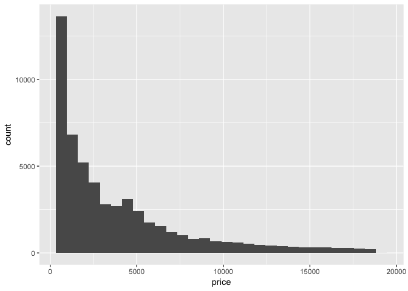
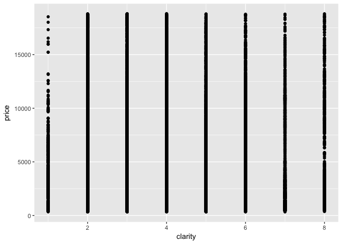
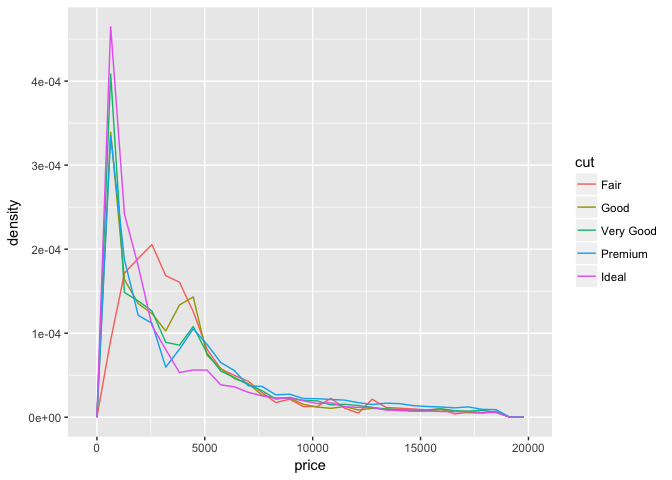

# Notebook_05242017_Kim.Seungmo

```r
library(tidyverse)
```

```
## Loading tidyverse: ggplot2
## Loading tidyverse: tibble
## Loading tidyverse: tidyr
## Loading tidyverse: readr
## Loading tidyverse: purrr
## Loading tidyverse: dplyr
```

```
## Conflicts with tidy packages ----------------------------------------------
```

```
## filter(): dplyr, stats
## lag():    dplyr, stats
```

#### 7.3.4 Exercises

1. Explore the distribution of each of the x, y, and z variables in diamonds. What do you learn? Think about a diamond and how you might decide which dimension is the length, width, and depth.


```r
head(diamonds)
```

```
## # A tibble: 6 × 10
##   carat       cut color clarity depth table price     x     y     z
##   <dbl>     <ord> <ord>   <ord> <dbl> <dbl> <int> <dbl> <dbl> <dbl>
## 1  0.23     Ideal     E     SI2  61.5    55   326  3.95  3.98  2.43
## 2  0.21   Premium     E     SI1  59.8    61   326  3.89  3.84  2.31
## 3  0.23      Good     E     VS1  56.9    65   327  4.05  4.07  2.31
## 4  0.29   Premium     I     VS2  62.4    58   334  4.20  4.23  2.63
## 5  0.31      Good     J     SI2  63.3    58   335  4.34  4.35  2.75
## 6  0.24 Very Good     J    VVS2  62.8    57   336  3.94  3.96  2.48
```

```r
summary(diamonds)
```

```
##      carat               cut        color        clarity     
##  Min.   :0.2000   Fair     : 1610   D: 6775   SI1    :13065  
##  1st Qu.:0.4000   Good     : 4906   E: 9797   VS2    :12258  
##  Median :0.7000   Very Good:12082   F: 9542   SI2    : 9194  
##  Mean   :0.7979   Premium  :13791   G:11292   VS1    : 8171  
##  3rd Qu.:1.0400   Ideal    :21551   H: 8304   VVS2   : 5066  
##  Max.   :5.0100                     I: 5422   VVS1   : 3655  
##                                     J: 2808   (Other): 2531  
##      depth           table           price             x         
##  Min.   :43.00   Min.   :43.00   Min.   :  326   Min.   : 0.000  
##  1st Qu.:61.00   1st Qu.:56.00   1st Qu.:  950   1st Qu.: 4.710  
##  Median :61.80   Median :57.00   Median : 2401   Median : 5.700  
##  Mean   :61.75   Mean   :57.46   Mean   : 3933   Mean   : 5.731  
##  3rd Qu.:62.50   3rd Qu.:59.00   3rd Qu.: 5324   3rd Qu.: 6.540  
##  Max.   :79.00   Max.   :95.00   Max.   :18823   Max.   :10.740  
##                                                                  
##        y                z         
##  Min.   : 0.000   Min.   : 0.000  
##  1st Qu.: 4.720   1st Qu.: 2.910  
##  Median : 5.710   Median : 3.530  
##  Mean   : 5.735   Mean   : 3.539  
##  3rd Qu.: 6.540   3rd Qu.: 4.040  
##  Max.   :58.900   Max.   :31.800  
## 
```

```r
## ???? Need help
```


2. Explore the distribution of price. Do you discover anything unusual or surprising? (Hint: Carefully think about the binwidth and make sure you try a wide range of values.)

```r
summary(diamonds$price)
```

```
##    Min. 1st Qu.  Median    Mean 3rd Qu.    Max. 
##     326     950    2401    3933    5324   18823
```

```r
p <- ggplot(diamonds, aes(x = price))
p + geom_histogram()
```

```
## `stat_bin()` using `bins = 30`. Pick better value with `binwidth`.
```

<!-- -->

```r
p + geom_histogram(binwidth = 1)
```

<!-- -->

```r
p + geom_histogram(binwidth = 2)
```

<!-- -->

```r
p + geom_histogram(binwidth = 5)
```

<!-- -->

```r
p + geom_histogram(binwidth = 10)
```

<!-- -->

```r
p + geom_histogram(binwidth = 10) + xlim(1250, 2000)
```

```
## Warning: Removed 47829 rows containing non-finite values (stat_bin).
```

<!-- -->

```r
p + geom_histogram(binwidth = 10) + xlim(1400, 1600)
```

```
## Warning: Removed 52871 rows containing non-finite values (stat_bin).
```

<!-- -->
No diamonds of $1450 to $1550.

3. How many diamonds are 0.99 carat? How many are 1 carat? What do you think is the cause of the difference?

```r
diamonds %>% 
  filter(carat == 0.99 | carat == 1) %>%
  group_by(carat) %>%
  summarize(count= n())
```

```
## # A tibble: 2 × 2
##   carat count
##   <dbl> <int>
## 1  0.99    23
## 2  1.00  1558
```
People including me like at least ONE carat of diamonds, which means NOT SMALL.  It is verified by my wife!

4. Compare and contrast coord_cartesian() vs xlim() or ylim() when zooming in on a histogram. What happens if you leave binwidth unset? What happens if you try and zoom so only half a bar shows?

```r
p <- ggplot(diamonds, aes(x = price)) 

p + geom_histogram(binwidth = 50) + coord_cartesian(xlim=c(500, 1000)) 
```

<!-- -->

```r
p + geom_histogram(binwidth = 50) + xlim(500,1000)
```

```
## Warning: Removed 41145 rows containing non-finite values (stat_bin).
```

<!-- -->

```r
# To show the designate range, xlim() or ylim() will remove but coord_cartesian() will not remove the outer range.

p + geom_histogram() + coord_cartesian(xlim=c(500, 1000))
```

```
## `stat_bin()` using `bins = 30`. Pick better value with `binwidth`.
```

<!-- -->

```r
p + geom_histogram() + xlim(500,1000) 
```

```
## `stat_bin()` using `bins = 30`. Pick better value with `binwidth`.
```

```
## Warning: Removed 41145 rows containing non-finite values (stat_bin).
```

```
## Warning: Removed 1 rows containing missing values (geom_bar).
```

<!-- -->

```r
# coord_cartesian will not change and xlim() will change the binwidth to do each job.
```

#### 7.5.1.1 Exercises

1. Use what you’ve learned to improve the visualisation of the departure times of cancelled vs. non-cancelled flights.

```r
library(nycflights13)
```


```r
flights_1 <- flights %>% 
  mutate(cancelled = is.na(dep_time)) %>% # add cancelled(yes/no)
  select(sched_dep_time, cancelled) # retrive only 2 variables
ggplot(flights_1, aes(x = cancelled)) + 
  geom_boxplot(aes(y = sched_dep_time))
```

<!-- -->
Canceled flights are distributed between 10am and 5pm, and flights that are not canceled between 2pm and 6pm.

2. What variable in the diamonds dataset is most important for predicting the price of a diamond? How is that variable correlated with cut? Why does the combination of those two relationships lead to lower quality diamonds being more expensive?


```r
# retrive only carrot, cut, color, clarity and price and  transform non-numerical variables into numerical values
diamonds_converted <- transmute(diamonds, carat, cut=as.integer(cut), color=as.integer(color), clarity=as.integer(clarity), price)

ggplot(diamonds_converted, aes(carat, price)) + geom_point()
```

<!-- -->

```r
ggplot(diamonds_converted, aes(color, price)) + geom_point()
```

<!-- -->

```r
ggplot(diamonds_converted, aes(clarity, price)) + geom_point()
```

<!-- -->

```r
# Price is strongly correlated with carrat.

p <- ggplot(diamonds_converted, aes(carat, price))  
p + geom_point(aes(color=cut), alpha=0.2)
```

<!-- -->

```r
p + geom_point(alpha=0.2) + facet_grid(.~cut)
```

<!-- -->

```r
# Price is strongly correlated regardless of cut.
```

3. Install the ggstance package, and create a horizontal boxplot. How does this compare to using coord_flip()?

```r
library(ggstance)
```

```
## 
## Attaching package: 'ggstance'
```

```
## The following objects are masked from 'package:ggplot2':
## 
##     geom_errorbarh, GeomErrorbarh
```


```r
ggplot(flights_1, aes(x = cancelled)) + 
  geom_boxplot(aes(y = sched_dep_time)) +
    coord_flip()
```

<!-- -->

```r
ggplot(flights_1, aes(x = cancelled)) + 
  geom_boxploth(aes(y = sched_dep_time)) # The x is switched with the y. 
```

```
## Warning: position_dodgev requires non-overlapping y intervals
```

<!-- -->

```r
ggplot(flights_1, aes(x = sched_dep_time)) + 
  geom_boxploth(aes(y = cancelled)) 
```

<!-- -->

4. One problem with boxplots is that they were developed in an era of much smaller datasets and tend to display a prohibitively large number of “outlying values”. One approach to remedy this problem is the letter value plot. Install the lvplot package, and try using geom_lv() to display the distribution of price vs cut. What do you learn? How do you interpret the plots?


```r
library(lvplot)
```


```r
ggplot(data = diamonds) +
  geom_boxplot(aes(x=cut, y=price))
```

<!-- -->


```r
ggplot(data = diamonds) +
  geom_lv(aes(x=cut, y=price))
```

<!-- -->


5. Compare and contrast geom_violin() with a facetted geom_histogram(), or a coloured geom_freqpoly(). What are the pros and cons of each method?

```r
p <- ggplot(data = diamonds) 
p + geom_histogram(aes(price)) + facet_grid(.~cut) # returns subplots by designated variable(e.g. cut)
```

```
## `stat_bin()` using `bins = 30`. Pick better value with `binwidth`.
```

<!-- -->

```r
p + geom_violin(aes(x = cut, y = price))
```

<!-- -->

```r
# returns graphs separated by the specified variable in a single  plot
ggplot(data = diamonds, aes(x = price, y = ..density..)) + 
  geom_freqpoly(aes(color = cut))
```

```
## `stat_bin()` using `bins = 30`. Pick better value with `binwidth`.
```

<!-- -->

```r
# returns graphs overlapped by the specified variable in a single plot
```
6. If you have a small dataset, it’s sometimes useful to use geom_jitter() to see the relationship between a continuous and categorical variable. The ggbeeswarm package provides a number of methods similar to geom_jitter(). List them and briefly describe what each one does.

```r
library(ggbeeswarm)
```


```r
ggplot(iris) + geom_point(aes(Species, Sepal.Length))
```

<!-- -->

```r
ggplot(iris) + geom_jitter(aes(Species, Sepal.Length))
```

<!-- -->

```r
qplot(Species, Sepal.Length, data=iris)+ geom_quasirandom()
```

<!-- -->

```r
qplot(Species, Sepal.Length, data=iris)+ geom_beeswarm(cex=3)
```

<!-- -->

```r
# to prevent from overplotting by offsetting points within categories
```

#### 7.5.2.1 Exercises

1. How could you rescale the count dataset above to more clearly show the distribution of cut within colour, or colour within cut?

```r
diamonds %>% 
  count(color, cut) %>%  
  ggplot(aes(x = color, y = cut)) +
    geom_tile(aes(fill = n)) +
    scale_fill_gradient2(low="red", mid="yellow", high="blue")
```

<!-- -->

2. Use geom_tile() together with dplyr to explore how average flight delays vary by destination and month of year. What makes the plot difficult to read? How could you improve it?

```r
flights %>% 
  count(arr_delay, dest) %>%  
  ggplot(aes(x = arr_delay, y = dest)) +
    geom_tile(aes(fill = n))
```

```
## Warning: Removed 100 rows containing missing values (geom_tile).
```

<!-- -->

```r
flights %>% 
  count(arr_delay, month) %>%  
  ggplot(aes(x = arr_delay, y = month)) +
    geom_tile(aes(fill = n))
```

```
## Warning: Removed 12 rows containing missing values (geom_tile).
```

<!-- -->

```r
flights %>%
  group_by(dest, month) %>%
  summarize(arr_delay_mean = mean(arr_delay, na.rm = TRUE)) %>%
  ggplot(aes(x = dest, y = month, fill = arr_delay_mean)) +
  geom_tile() 
```

<!-- -->


3. Why is it slightly better to use aes(x = color, y = cut) rather than aes(x = cut, y = color) in the example above?

```r
diamonds %>% 
  count(color, cut) %>%  
  ggplot(mapping = aes(x = color, y = cut)) +
    geom_tile(mapping = aes(fill = n))
```

<!-- -->

```r
diamonds %>% 
  count(color, cut) %>%  
  ggplot(mapping = aes(x = cut, y = color)) +
    geom_tile(mapping = aes(fill = n))
```

<!-- -->


## 7.5.3.1 Exercises

1. Instead of summarising the conditional distribution with a boxplot, you could use a frequency polygon. What do you need to consider when using cut_width() vs cut_number()? How does that impact a visualisation of the 2d distribution of carat and price?

```r
ggplot(diamonds, aes(x = price, color = cut_width(carat, 0.1))) +
  geom_freqpoly()
```

```
## `stat_bin()` using `bins = 30`. Pick better value with `binwidth`.
```

<!-- -->

```r
ggplot(diamonds, aes(x = price, colour = cut_number(carat, 20))) +
  geom_freqpoly()
```

```
## `stat_bin()` using `bins = 30`. Pick better value with `binwidth`.
```

<!-- -->


2. Visualise the distribution of carat, partitioned by price.

```r
ggplot(diamonds, aes(x = cut_width(price, 5000), y = carat)) +
  geom_boxplot(varwidth = TRUE)
```

<!-- -->

```r
ggplot(diamonds, aes(x = cut_number(price, 5), y = carat)) +
  geom_boxplot()
```

<!-- -->

3. How does the price distribution of very large diamonds compare to small diamonds. Is it as you expect, or does it surprise you?

4. Combine two of the techniques you’ve learned to visualise the combined distribution of cut, carat, and price.

5. Two dimensional plots reveal outliers that are not visible in one dimensional plots. For example, some points in the plot below have an unusual combination of x and y values, which makes the points outliers even though their x and y values appear normal when examined separately.

ggplot(data = diamonds) +
  geom_point(mapping = aes(x = x, y = y)) +
  coord_cartesian(xlim = c(4, 11), ylim = c(4, 11))
