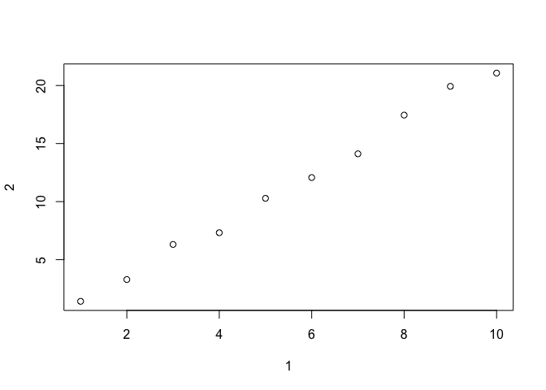

# 05312017_Kim.Seungmo


#### 10.5 Exercises

1. How can you tell if an object is a tibble? (Hint: try printing mtcars, which is a regular data frame).


```r
mtcars %>% is_tibble()
```

```
## [1] FALSE
```

```r
as.tibble(mtcars) %>% is_tibble()
```

```
## [1] TRUE
```

    When we print a tibble, it only shows the first 10 rows and all the columns that fit on one screen. It also prints an abbreviated description of the column type.


2. Compare and contrast the following operations on a data.frame and equivalent tibble. What is different? Why might the default data frame behaviours cause you frustration?

```r
df <- data.frame(abc = 1, xyz = "a")  
df
```

```
##   abc xyz
## 1   1   a
```

```r
df$a # allows partial matching
```

```
## [1] 1
```

```r
df[, "xyz"]
```

```
## [1] a
## Levels: a
```

```r
df[, c("abc", "xyz")]
```

```
##   abc xyz
## 1   1   a
```


```r
df1 <- tibble(abc = 1, xyz = "a")
df1
```

```
## # A tibble: 1 × 2
##     abc   xyz
##   <dbl> <chr>
## 1     1     a
```

```r
# to extract a single column, use $ or [[ ]]
df1$abc # Tibbles do not allow partial matching(e.g. df$a)
```

```
## [1] 1
```

```r
df1[, "xyz"]
```

```
## # A tibble: 1 × 1
##     xyz
##   <chr>
## 1     a
```

```r
df1[["xyz"]]
```

```
## [1] "a"
```

```r
df1[, c("abc", "xyz")]
```

```
## # A tibble: 1 × 2
##     abc   xyz
##   <dbl> <chr>
## 1     1     a
```

    Honestly, I have not been frustrated in using data.frame yet...


3. If you have the name of a variable stored in an object, e.g. var <- "mpg", how can you extract the reference variable from a tibble?

```r
mpg
```

```
## # A tibble: 234 × 11
##    manufacturer      model displ  year   cyl      trans   drv   cty   hwy
##           <chr>      <chr> <dbl> <int> <int>      <chr> <chr> <int> <int>
## 1          audi         a4   1.8  1999     4   auto(l5)     f    18    29
## 2          audi         a4   1.8  1999     4 manual(m5)     f    21    29
## 3          audi         a4   2.0  2008     4 manual(m6)     f    20    31
## 4          audi         a4   2.0  2008     4   auto(av)     f    21    30
## 5          audi         a4   2.8  1999     6   auto(l5)     f    16    26
## 6          audi         a4   2.8  1999     6 manual(m5)     f    18    26
## 7          audi         a4   3.1  2008     6   auto(av)     f    18    27
## 8          audi a4 quattro   1.8  1999     4 manual(m5)     4    18    26
## 9          audi a4 quattro   1.8  1999     4   auto(l5)     4    16    25
## 10         audi a4 quattro   2.0  2008     4 manual(m6)     4    20    28
## # ... with 224 more rows, and 2 more variables: fl <chr>, class <chr>
```

```r
var <- "drv" # store driving mode(e.g. f=front-wheel) in a new variable var

mpg[var]
```

```
## # A tibble: 234 × 1
##      drv
##    <chr>
## 1      f
## 2      f
## 3      f
## 4      f
## 5      f
## 6      f
## 7      f
## 8      4
## 9      4
## 10     4
## # ... with 224 more rows
```

```r
mpg[[var]]
```

```
##   [1] "f" "f" "f" "f" "f" "f" "f" "4" "4" "4" "4" "4" "4" "4" "4" "4" "4"
##  [18] "4" "r" "r" "r" "r" "r" "r" "r" "r" "r" "r" "4" "4" "4" "4" "f" "f"
##  [35] "f" "f" "f" "f" "f" "f" "f" "f" "f" "f" "f" "f" "f" "f" "4" "4" "4"
##  [52] "4" "4" "4" "4" "4" "4" "4" "4" "4" "4" "4" "4" "4" "4" "4" "4" "4"
##  [69] "4" "4" "4" "4" "4" "4" "r" "r" "r" "4" "4" "4" "4" "4" "4" "4" "4"
##  [86] "4" "4" "4" "4" "4" "r" "r" "r" "r" "r" "r" "r" "r" "r" "f" "f" "f"
## [103] "f" "f" "f" "f" "f" "f" "f" "f" "f" "f" "f" "f" "f" "f" "f" "f" "f"
## [120] "f" "f" "f" "4" "4" "4" "4" "4" "4" "4" "4" "4" "4" "4" "4" "r" "r"
## [137] "r" "4" "4" "4" "4" "f" "f" "f" "f" "f" "f" "f" "f" "f" "4" "4" "4"
## [154] "4" "f" "f" "f" "f" "f" "4" "4" "4" "4" "4" "4" "4" "4" "4" "4" "4"
## [171] "4" "4" "4" "4" "4" "4" "4" "4" "4" "f" "f" "f" "f" "f" "f" "f" "f"
## [188] "f" "f" "f" "f" "f" "f" "f" "f" "f" "f" "f" "4" "4" "4" "4" "4" "4"
## [205] "4" "4" "4" "f" "f" "f" "f" "f" "f" "f" "f" "f" "f" "f" "f" "f" "f"
## [222] "f" "f" "f" "f" "f" "f" "f" "f" "f" "f" "f" "f" "f"
```

```r
mpg[,var]
```

```
## # A tibble: 234 × 1
##      drv
##    <chr>
## 1      f
## 2      f
## 3      f
## 4      f
## 5      f
## 6      f
## 7      f
## 8      4
## 9      4
## 10     4
## # ... with 224 more rows
```

4. Practice referring to non-syntactic names in the following data frame by:

```r
annoying <- tibble(
  `1` = 1:10,
  `2` = `1` * 2 + rnorm(length(`1`))
)
annoying
```

```
## # A tibble: 10 × 2
##      `1`       `2`
##    <int>     <dbl>
## 1      1  1.413672
## 2      2  3.288968
## 3      3  6.311715
## 4      4  7.323160
## 5      5 10.281758
## 6      6 12.072114
## 7      7 14.115963
## 8      8 17.452347
## 9      9 19.926926
## 10    10 21.068541
```

  1. Extracting the variable called 1.

```r
annoying$`1` # variable named 1
```

```
##  [1]  1  2  3  4  5  6  7  8  9 10
```

```r
annoying[, '1'] # variable named 1
```

```
## # A tibble: 10 × 1
##      `1`
##    <int>
## 1      1
## 2      2
## 3      3
## 4      4
## 5      5
## 6      6
## 7      7
## 8      8
## 9      9
## 10    10
```

```r
annoying[, 1] # the 1st column
```

```
## # A tibble: 10 × 1
##      `1`
##    <int>
## 1      1
## 2      2
## 3      3
## 4      4
## 5      5
## 6      6
## 7      7
## 8      8
## 9      9
## 10    10
```

  2. Plotting a scatterplot of 1 vs 2.

```r
plot(annoying, 1, 2)  
```

<!-- -->

  3. Creating a new column called 3 which is 2 divided by 1.

```r
annoying %>%
  mutate(`3` = `2` / `1`)
```

```
## # A tibble: 10 × 3
##      `1`       `2`      `3`
##    <int>     <dbl>    <dbl>
## 1      1  1.413672 1.413672
## 2      2  3.288968 1.644484
## 3      3  6.311715 2.103905
## 4      4  7.323160 1.830790
## 5      5 10.281758 2.056352
## 6      6 12.072114 2.012019
## 7      7 14.115963 2.016566
## 8      8 17.452347 2.181543
## 9      9 19.926926 2.214103
## 10    10 21.068541 2.106854
```


  4. Renaming the columns to one, two and three.


```r
annoying %>%
  mutate(`3` = `2` / `1`) %>%
  transmute('one' = `1`, `two` = `2`, `three` = `3`)
```

```
## # A tibble: 10 × 3
##      one       two    three
##    <int>     <dbl>    <dbl>
## 1      1  1.413672 1.413672
## 2      2  3.288968 1.644484
## 3      3  6.311715 2.103905
## 4      4  7.323160 1.830790
## 5      5 10.281758 2.056352
## 6      6 12.072114 2.012019
## 7      7 14.115963 2.016566
## 8      8 17.452347 2.181543
## 9      9 19.926926 2.214103
## 10    10 21.068541 2.106854
```


5. What does tibble::enframe() do? When might you use it?

    enframe() converts vectors or lists to two-column data frames. To create tibbles quickly and easily using vectors.

```r
enframe(1:3)
```

```
## # A tibble: 3 × 2
##    name value
##   <int> <int>
## 1     1     1
## 2     2     2
## 3     3     3
```

```r
enframe(c(a=2, b=4, c=10))
```

```
## # A tibble: 3 × 2
##    name value
##   <chr> <dbl>
## 1     a     2
## 2     b     4
## 3     c    10
```

    
6. What option controls how many additional column names are printed at the footer of a tibble?


```r
library(nycflights13)
is_tibble(flights)
```

```
## [1] TRUE
```

```r
flights # print the first 10 rows and the columns that fit on the screen by default, and show the other variables at the footer. 
```

```
## # A tibble: 336,776 × 19
##     year month   day dep_time sched_dep_time dep_delay arr_time
##    <int> <int> <int>    <int>          <int>     <dbl>    <int>
## 1   2013     1     1      517            515         2      830
## 2   2013     1     1      533            529         4      850
## 3   2013     1     1      542            540         2      923
## 4   2013     1     1      544            545        -1     1004
## 5   2013     1     1      554            600        -6      812
## 6   2013     1     1      554            558        -4      740
## 7   2013     1     1      555            600        -5      913
## 8   2013     1     1      557            600        -3      709
## 9   2013     1     1      557            600        -3      838
## 10  2013     1     1      558            600        -2      753
## # ... with 336,766 more rows, and 12 more variables: sched_arr_time <int>,
## #   arr_delay <dbl>, carrier <chr>, flight <int>, tailnum <chr>,
## #   origin <chr>, dest <chr>, air_time <dbl>, distance <dbl>, hour <dbl>,
## #   minute <dbl>, time_hour <dttm>
```

```r
options(tibble.max_extra_cols=5) # show only three other variables in the footer
flights
```

```
## # A tibble: 336,776 × 19
##     year month   day dep_time sched_dep_time dep_delay arr_time
##    <int> <int> <int>    <int>          <int>     <dbl>    <int>
## 1   2013     1     1      517            515         2      830
## 2   2013     1     1      533            529         4      850
## 3   2013     1     1      542            540         2      923
## 4   2013     1     1      544            545        -1     1004
## 5   2013     1     1      554            600        -6      812
## 6   2013     1     1      554            558        -4      740
## 7   2013     1     1      555            600        -5      913
## 8   2013     1     1      557            600        -3      709
## 9   2013     1     1      557            600        -3      838
## 10  2013     1     1      558            600        -2      753
## # ... with 336,766 more rows, and 12 more variables: sched_arr_time <int>,
## #   arr_delay <dbl>, carrier <chr>, flight <int>, tailnum <chr>, ...
```

