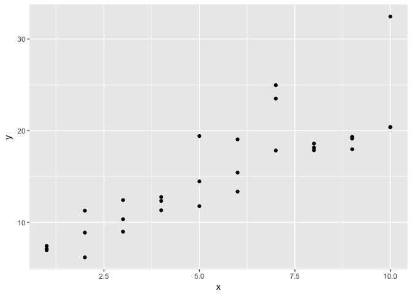
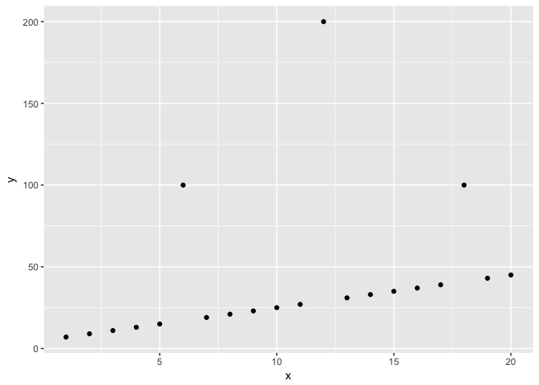
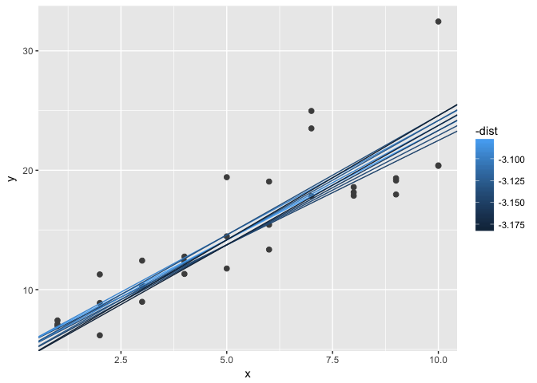
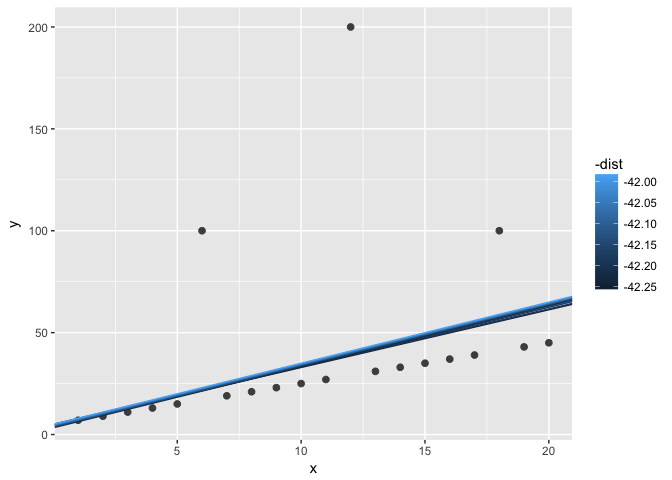
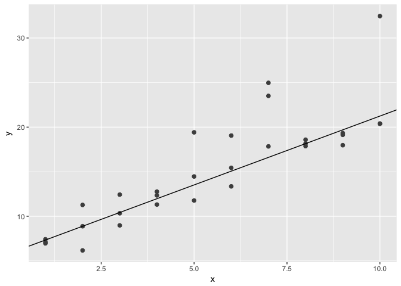
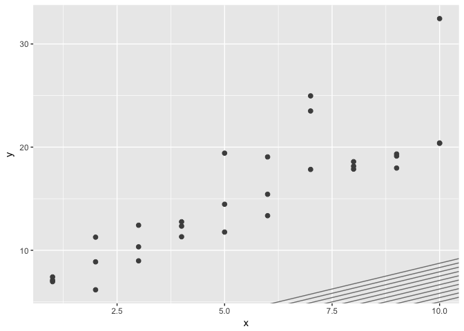

# 09202017_Kim.Seungmo


 
23.2.1 Exercises

1. One downside of the linear model is that it is sensitive to unusual values because the distance incorporates a squared term. Fit a linear model to the simulated data below, and visualise the results. Rerun a few times to generate different simulated datasets. What do you notice about the model?


```r
#set linear model with two parameters: y-intercept & slope
my.func.ex1 <- function (data) {

  model1 <- function(a, data) {  
    a[1] + data$x * a[2]
  }

#to compute an overall distance between the predicted and actual values
# by using root-mean-squared deviation
  measure_distance <- function(mod, data) {  
    diff <- data$y - model1(mod, data)
    sqrt(mean(diff ^ 2))
  }

#to compute the distance for all the models defined above
  sim1_dist <- function(a1, a2) {
    measure_distance(c(a1, a2), data)
  }

#to try several models by generating an evenly spaced grid of points("grid search") 
  grid <- expand.grid(
    a1 = seq(-5, 5, length = 25),
    a2 = seq(1, 3, length = 25)
     ) %>% 
     mutate(dist = purrr::map2_dbl(a1, a2, sim1_dist))

#grid %>% 
#  ggplot(aes(a1, a2)) +
#  geom_point(data = filter(grid, rank(dist) <= 10), size = 4, colour = "red") +
#  geom_point(aes(colour = -dist))

# render best 10 models
  ggplot(data, aes(x, y)) + 
    geom_point(size = 2, colour = "grey30") + 
    geom_abline(
     aes(intercept = a1, slope = a2, colour = -dist), 
      data = filter(grid, rank(dist) <= 10)
  )
}
```


```r
sim1a <- tibble(
  x = rep(1:10, each = 3),
  y = x * 1.5 + 6 + rt(length(x), df = 2)
)
sim1a
```

```
## # A tibble: 30 × 2
##        x         y
##    <int>     <dbl>
## 1      1  7.095252
## 2      1  7.418960
## 3      1  6.959228
## 4      2  8.880511
## 5      2  6.170665
## 6      2 11.273639
## 7      3 10.337048
## 8      3  8.977209
## 9      3 12.429586
## 10     4 12.342847
## # ... with 20 more rows
```

```r
#to figure out what the data look like
ggplot(sim1a, aes(x, y)) + 
  geom_point()
```

<!-- -->

```r
sim1b <- tibble(
  x = 1:20,
  y = c(7,9,11,13,15,100,19,21,23,25,27,200,31,33,35,37,39,100,43,45)  
 )
ggplot(sim1b, aes(x, y)) + 
  geom_point() 
```

<!-- -->

```r
my.func.ex1(sim1a)
```

<!-- -->

```r
my.func.ex1(sim1b)
```

<!-- -->
A few unusual values("outliers") may have the linear model to deviate from the expected line. Such an effect will be greater in case of small size of data set.  
<br><br>


2. One way to make linear models more robust is to use a different distance measure. For example, instead of root-mean-squared distance, you could use mean-absolute distance:

```r
my.func.ex2 <- function (data) {
  model1 <- function(a, data) {  
    a[1] + data$x * a[2]
  }

#to compute an overall distance between the predicted and actual values
  measure_distance <- function(mod, data) {
    diff <- data$y - model1(mod, data)
    mean(abs(diff))
  }

  best <- optim(c(0, 0), measure_distance, data = data)
  best$par

  ggplot(sim1a, aes(x, y)) + 
    geom_point(size = 2, colour = "grey30") + 
    geom_abline(intercept = best$par[1], slope = best$par[2])
}
```


```r
my.func.ex2(sim1a)
```

<!-- -->

```r
my.func.ex1(sim1a)
```

<!-- -->
<br><br>


3. One challenge with performing numerical optimisation is that it’s only guaranteed to find one local optima. What’s the problem with optimising a three parameter model like this??????????????????


```r
#set linear model with two parameters: y-intercept & slope
my.func.ex3 <- function (data) {

  model1 <- function(a, data) {  
    a[1] + data$x * a[2] + a[3]
  }

#to compute an overall distance between the predicted and actual values
# by using root-mean-squared deviation
  measure_distance <- function(mod, data) {  
    diff <- data$y - model1(mod, data)
    sqrt(mean(diff ^ 2))
  }

#to compute the distance for all the models defined above
  sim1_dist <- function(a1, a2) {
    measure_distance(c(a1, a2), data)
  }

#to try several models by generating an evenly spaced grid of points("grid search") 
  grid <- expand.grid(
    a1 = seq(-5, 5, length = 25),
    a2 = seq(1, 3, length = 25)
     ) %>% 
     mutate(dist = purrr::map2_dbl(a1, a2, sim1_dist))

#grid %>% 
#  ggplot(aes(a1, a2)) +
#  geom_point(data = filter(grid, rank(dist) <= 10), size = 4, colour = "red") +
#  geom_point(aes(colour = -dist))

# render best 10 models
  ggplot(data, aes(x, y)) + 
    geom_point(size = 2, colour = "grey30") + 
    geom_abline(
     aes(intercept = a1, slope = a2, colour = -dist), 
      data = filter(grid, rank(dist) <= 10)
  )
}
```


```r
my.func.ex3(sim1a)
```

<!-- -->


}
