# 09202017_Kim.Seungmo


 
23.3.3 Exercises

1. Instead of using lm() to fit a straight line, you can use loess() to fit a smooth curve. Repeat the process of model fitting, grid generation, predictions, and visualisation on sim1 using loess() instead of lm(). How does the result compare to geom_smooth()?

```r
sim1_loess <- loess(y ~ x, data = sim1)
sim1 %>%
  add_predictions(sim1_loess) %>%
    ggplot(aes(x = x)) +
     geom_point(aes(y = y)) +
     geom_line(aes(y = pred), colour = "red")
```

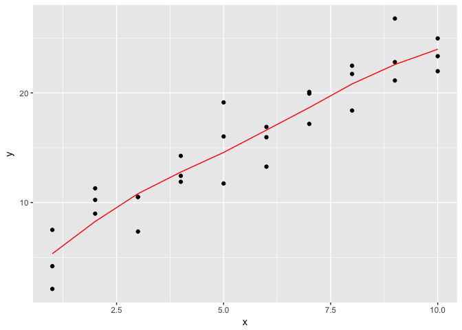<!-- -->

    The loess prediction gives a nonlinear prediction with smooth line.
    

```r
pl <- sim1 %>%
       ggplot(aes(x = x, y = y)) +
        geom_point() 
pl +  geom_smooth(colour = "red", se=FALSE) 
```

```
## `geom_smooth()` using method = 'loess'
```

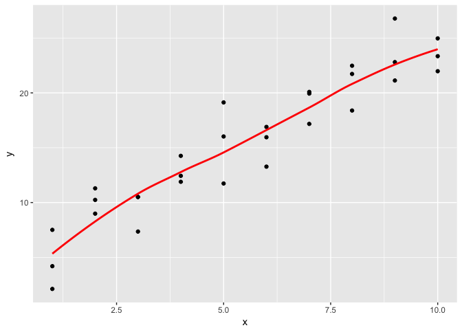<!-- -->

```r
pl +  geom_smooth(method= "lm", se=FALSE, colour = "red") 
```

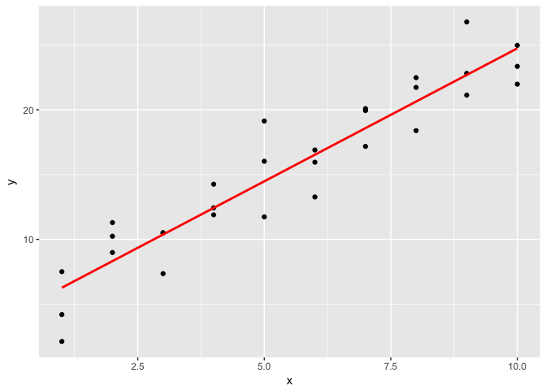<!-- -->
2. add_predictions() is paired with gather_predictions() and spread_predictions(). How do these three functions differ?

    add_prediction adds a single new column, .pred, to the input data. spread_predictions adds one column for each model. gather_prections adds two columns .model and .pred, and repeats the input rows for each model.
 

```r
df <- tibble::data_frame(
  x = sort(runif(100)),
  y = 5 * x + 0.5 * x ^ 2 + 3 + rnorm(length(x))
)
plot(df)
```

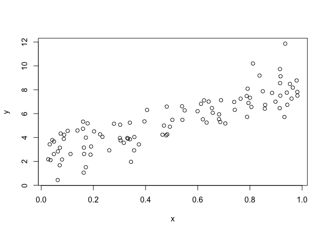<!-- -->

```r
m1 <- lm(y ~ x, data = df)
grid <- data.frame(x = seq(0, 1, length = 10))
grid %>% add_predictions(m1)
```

```
##            x     pred
## 1  0.0000000 2.433296
## 2  0.1111111 3.088653
## 3  0.2222222 3.744009
## 4  0.3333333 4.399366
## 5  0.4444444 5.054722
## 6  0.5555556 5.710078
## 7  0.6666667 6.365435
## 8  0.7777778 7.020791
## 9  0.8888889 7.676148
## 10 1.0000000 8.331504
```

```r
m2 <- lm(y ~ poly(x, 2), data = df)
grid %>% spread_predictions(m1, m2)
```

```
##            x       m1       m2
## 1  0.0000000 2.433296 2.642248
## 2  0.1111111 3.088653 3.163274
## 3  0.2222222 3.744009 3.717657
## 4  0.3333333 4.399366 4.305395
## 5  0.4444444 5.054722 4.926489
## 6  0.5555556 5.710078 5.580940
## 7  0.6666667 6.365435 6.268746
## 8  0.7777778 7.020791 6.989908
## 9  0.8888889 7.676148 7.744426
## 10 1.0000000 8.331504 8.532300
```

```r
grid %>% gather_predictions(m1, m2)
```

```
##    model         x     pred
## 1     m1 0.0000000 2.433296
## 2     m1 0.1111111 3.088653
## 3     m1 0.2222222 3.744009
## 4     m1 0.3333333 4.399366
## 5     m1 0.4444444 5.054722
## 6     m1 0.5555556 5.710078
## 7     m1 0.6666667 6.365435
## 8     m1 0.7777778 7.020791
## 9     m1 0.8888889 7.676148
## 10    m1 1.0000000 8.331504
## 11    m2 0.0000000 2.642248
## 12    m2 0.1111111 3.163274
## 13    m2 0.2222222 3.717657
## 14    m2 0.3333333 4.305395
## 15    m2 0.4444444 4.926489
## 16    m2 0.5555556 5.580940
## 17    m2 0.6666667 6.268746
## 18    m2 0.7777778 6.989908
## 19    m2 0.8888889 7.744426
## 20    m2 1.0000000 8.532300
```
3. What does geom_ref_line() do? What package does it come from? Why is displaying a reference line in plots showing residuals useful and important?

    geom_ref_line () adds a reference line to the plot.
    library(modelr)
    Residuals of good model should be randomly distributed centered at zero, so a reference line at zero is a good way to evaluate if the model is appropriate.


4. Why might you want to look at a frequency polygon of absolute residuals? What are the pros and cons compared to looking at the raw residuals?

    The frequency polygon of absolute residuals help us understand the spread of the residuals. This helps us calibrate the quality of the model: how far away are the predictions from the observed values? The average of the residual should always be 0 for good model.


23.4.5 Exercises

1. What happens if you repeat the analysis of sim2 using a model without an intercept. What happens to the model equation? What happens to the predictions?

```r
sim2
```

```
## # A tibble: 40 × 2
##        x          y
##    <chr>      <dbl>
## 1      a  1.9353632
## 2      a  1.1764886
## 3      a  1.2436855
## 4      a  2.6235489
## 5      a  1.1120381
## 6      a  0.8660030
## 7      a -0.9100875
## 8      a  0.7207628
## 9      a  0.6865540
## 10     a  2.0673079
## # ... with 30 more rows
```

```r
sim2_mod <- lm(y ~ x - 1, data=sim2) #remove the intercept term
summary(sim2_mod)
```

```
## 
## Call:
## lm(formula = y ~ x - 1, data = sim2)
## 
## Residuals:
##      Min       1Q   Median       3Q      Max 
## -2.40131 -0.43996 -0.05776  0.49066  2.63938 
## 
## Coefficients:
##    Estimate Std. Error t value Pr(>|t|)    
## xa   1.1522     0.3475   3.316  0.00209 ** 
## xb   8.1160     0.3475  23.356  < 2e-16 ***
## xc   6.1272     0.3475  17.633  < 2e-16 ***
## xd   1.9110     0.3475   5.499 3.25e-06 ***
## ---
## Signif. codes:  0 '***' 0.001 '**' 0.01 '*' 0.05 '.' 0.1 ' ' 1
## 
## Residual standard error: 1.099 on 36 degrees of freedom
## Multiple R-squared:  0.9614,	Adjusted R-squared:  0.9572 
## F-statistic: 224.4 on 4 and 36 DF,  p-value: < 2.2e-16
```

```r
# predictions
sim2 %>% 
  add_predictions(sim2_mod) %>%
  ggplot(aes(x=x)) +
  geom_line(aes(y=pred), colour = "red") +
  geom_point(aes(y=y)) 
```

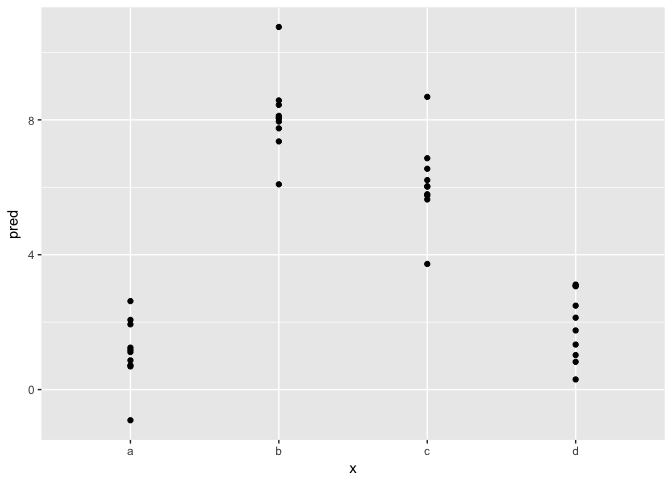<!-- -->

```r
# residuals
sim2 %>%
  add_residuals(sim2_mod) %>%
  ggplot(aes(x, resid)) +
  geom_point() +
  geom_smooth(se = FALSE) +
  geom_hline(yintercept = 0, colour = "red", linetype = 2, size = 0.5)
```

```
## `geom_smooth()` using method = 'loess'
```

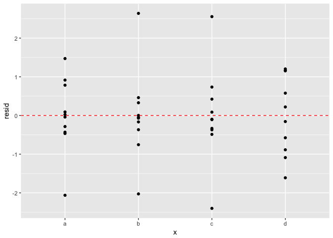<!-- -->

2. Use model_matrix() to explore the equations generated for the models I fit to sim3 and sim4. Why is * a good shorthand for interaction?

```r
sim3
```

```
## # A tibble: 120 × 5
##       x1     x2   rep          y    sd
##    <int> <fctr> <int>      <dbl> <dbl>
## 1      1      a     1 -0.5707363     2
## 2      1      a     2  1.1841503     2
## 3      1      a     3  2.2373204     2
## 4      1      b     1  7.4366963     2
## 5      1      b     2  8.5182934     2
## 6      1      b     3  7.7239098     2
## 7      1      c     1  6.5067480     2
## 8      1      c     2  5.7900643     2
## 9      1      c     3  6.0721817     2
## 10     1      d     1  2.1096727     2
## # ... with 110 more rows
```

```r
model_matrix(sim3, y ~ x1 + x2)
```

```
## # A tibble: 120 × 5
##    `(Intercept)`    x1   x2b   x2c   x2d
##            <dbl> <dbl> <dbl> <dbl> <dbl>
## 1              1     1     0     0     0
## 2              1     1     0     0     0
## 3              1     1     0     0     0
## 4              1     1     1     0     0
## 5              1     1     1     0     0
## 6              1     1     1     0     0
## 7              1     1     0     1     0
## 8              1     1     0     1     0
## 9              1     1     0     1     0
## 10             1     1     0     0     1
## # ... with 110 more rows
```

```r
model_matrix(sim3, y ~ x1 * x2)
```

```
## # A tibble: 120 × 8
##    `(Intercept)`    x1   x2b   x2c   x2d `x1:x2b` `x1:x2c` `x1:x2d`
##            <dbl> <dbl> <dbl> <dbl> <dbl>    <dbl>    <dbl>    <dbl>
## 1              1     1     0     0     0        0        0        0
## 2              1     1     0     0     0        0        0        0
## 3              1     1     0     0     0        0        0        0
## 4              1     1     1     0     0        1        0        0
## 5              1     1     1     0     0        1        0        0
## 6              1     1     1     0     0        1        0        0
## 7              1     1     0     1     0        0        1        0
## 8              1     1     0     1     0        0        1        0
## 9              1     1     0     1     0        0        1        0
## 10             1     1     0     0     1        0        0        1
## # ... with 110 more rows
```


3. Using the basic principles, convert the formulas in the following two models into functions. (Hint: start by converting the categorical variable into 0-1 variables.)

```r
mod1 <- lm(y ~ x1 + x2, data = sim3)
mod2 <- lm(y ~ x1 * x2, data = sim3)
```


4. For sim4, which of mod1 and mod2 is better? I think mod2 does a slightly better job at removing patterns, but it’s pretty subtle. Can you come up with a plot to support my claim?

```r
sim4
```

```
## # A tibble: 300 × 4
##       x1         x2   rep           y
##    <dbl>      <dbl> <int>       <dbl>
## 1     -1 -1.0000000     1  4.24767769
## 2     -1 -1.0000000     2  1.20599701
## 3     -1 -1.0000000     3  0.35347770
## 4     -1 -0.7777778     1 -0.04665814
## 5     -1 -0.7777778     2  4.63868987
## 6     -1 -0.7777778     3  1.37709540
## 7     -1 -0.5555556     1  0.97522088
## 8     -1 -0.5555556     2  2.49963753
## 9     -1 -0.5555556     3  2.70474837
## 10    -1 -0.3333333     1  0.55751522
## # ... with 290 more rows
```

```r
sim4_mod1 <- lm(y ~ x1 + x2, data = sim4)
summary(sim4_mod1)
```

```
## 
## Call:
## lm(formula = y ~ x1 + x2, data = sim4)
## 
## Residuals:
##     Min      1Q  Median      3Q     Max 
## -5.5514 -1.3859 -0.1107  1.4928  4.7180 
## 
## Coefficients:
##             Estimate Std. Error t value Pr(>|t|)    
## (Intercept)  0.03546    0.12184   0.291    0.771    
## x1           1.82167    0.19089   9.543   <2e-16 ***
## x2          -2.78252    0.19089 -14.577   <2e-16 ***
## ---
## Signif. codes:  0 '***' 0.001 '**' 0.01 '*' 0.05 '.' 0.1 ' ' 1
## 
## Residual standard error: 2.11 on 297 degrees of freedom
## Multiple R-squared:  0.5055,	Adjusted R-squared:  0.5021 
## F-statistic: 151.8 on 2 and 297 DF,  p-value: < 2.2e-16
```

```r
sim4_mod2 <- lm(y ~ x1 * x2, data = sim4)
summary(sim4_mod2)
```

```
## 
## Call:
## lm(formula = y ~ x1 * x2, data = sim4)
## 
## Residuals:
##     Min      1Q  Median      3Q     Max 
## -5.9629 -1.4165 -0.1032  1.4284  4.9957 
## 
## Coefficients:
##             Estimate Std. Error t value Pr(>|t|)    
## (Intercept)  0.03546    0.11995   0.296  0.76772    
## x1           1.82167    0.18792   9.694  < 2e-16 ***
## x2          -2.78252    0.18792 -14.807  < 2e-16 ***
## x1:x2        0.95228    0.29441   3.235  0.00136 ** 
## ---
## Signif. codes:  0 '***' 0.001 '**' 0.01 '*' 0.05 '.' 0.1 ' ' 1
## 
## Residual standard error: 2.078 on 296 degrees of freedom
## Multiple R-squared:  0.5223,	Adjusted R-squared:  0.5175 
## F-statistic: 107.9 on 3 and 296 DF,  p-value: < 2.2e-16
```

```r
plot(sim4_mod1)
```

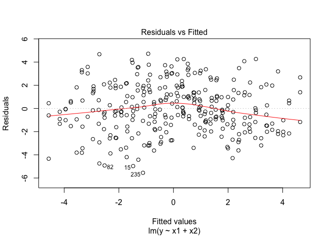<!-- -->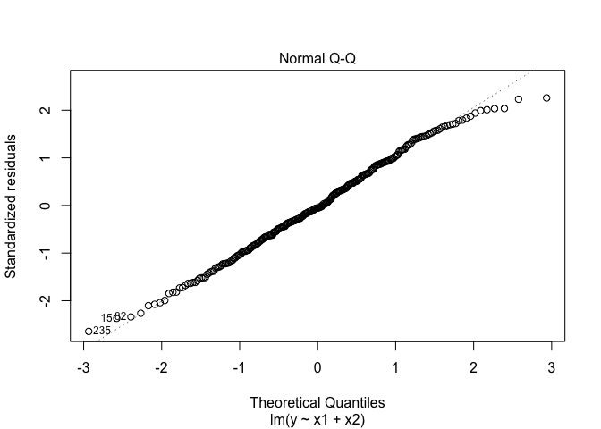<!-- -->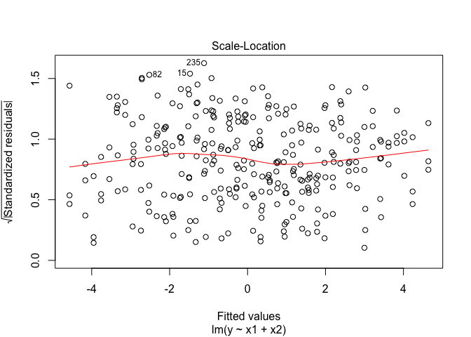<!-- -->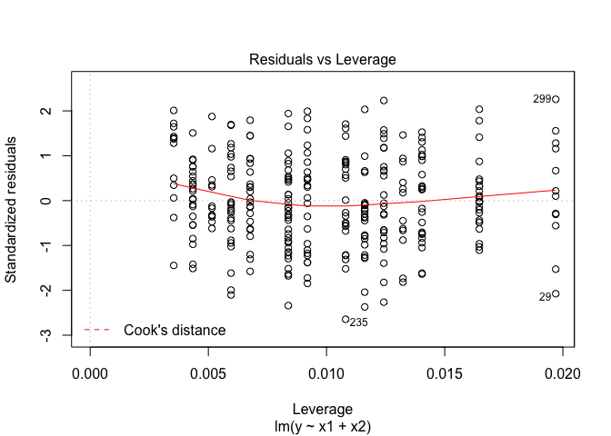<!-- -->

```r
plot(sim4_mod2)
```

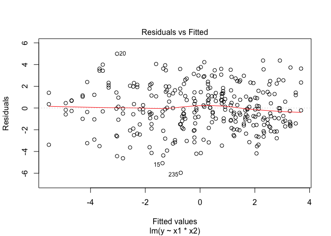<!-- -->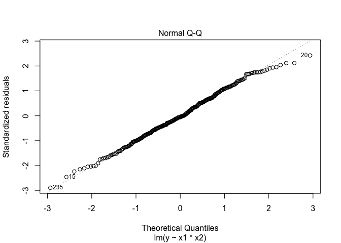<!-- -->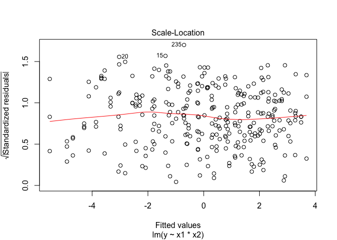<!-- -->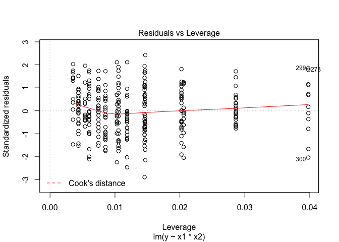<!-- -->

    **Residuals vs Fitted plot**: shows the residual errors plotted versus their fitted values. The residuals should be randomly distributed around the horizontal line representing a residual error of zero; that is, there should not be a distinct trend in the distribution of points. 
    **Normal Q-Q plot**: suggests that the residual errors are normally distributed. 
    **scale-location plot**: shows the square root of the standardized residuals (sort of a square root of relative error) as a function of the fitted values. Again, there should be no obvious trend in this plot.
    **Residuals vs Leverage plot**: shows each points leverage, which is a measure of its importance in determining the regression result. Superimposed on the plot are contour lines for the Cook’s distance, which is another measure of the importance of each observation to the regression. Smaller distances means that removing the observation has little affect on the regression results. Distances larger than 1 are suspicious and suggest the presence of a possible outlier or a poor model. 
    Both models are fairly acceptable.  mod2 would be a little better than mod1.
    
    
    
    


